# Traction Workbench

**Traction Engineering Feasibility & System Analysis Workbench** — 단일 3상 2-level 인버터 + PMSM/IPMSM의
정상상태 기본파 모델로 고객 요구를 판정하고, 그 근거를 그래프와 재현 가능한 **Engineering Decision Record**로 남기는
**독립 실행형 데스크톱 애플리케이션**입니다 (Windows `.exe`, 서버·네트워크·Python 설치 불필요).

> “현재 조건에서 고객 요구를 만족시킬 수 있는가? 무엇이 막고 있으며, 어떤 변경이나 추가 자료가 의사결정을 바꾸는가?”

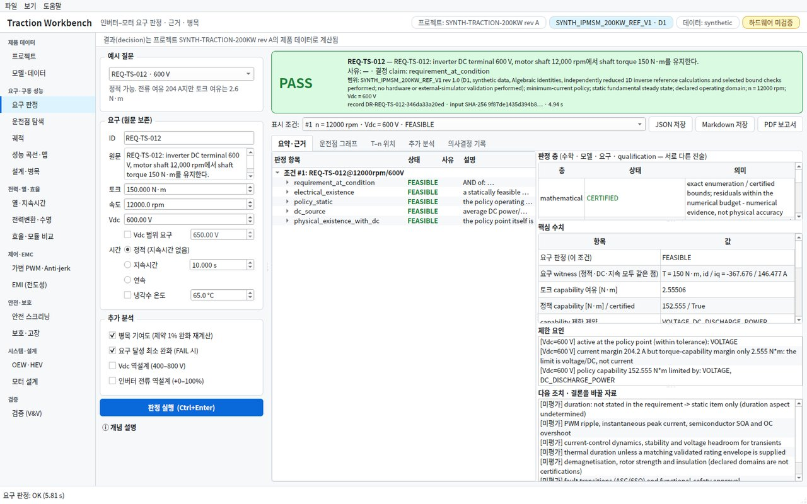

## 실행 (Windows)

1. `TractionWorkbench-<버전>-windows-x64.zip`을 받습니다 — GitHub **Actions → build → Artifacts**
   (`TractionWorkbench-windows-x64`) 또는 `v*` 태그를 올리면 자동 생성되는 **Releases**.
2. 압축을 풀고 `TractionWorkbench\TractionWorkbench.exe`를 실행합니다. 설치·관리자 권한이 필요 없습니다(휴대용 폴더).
3. 코드 서명이 없어서 처음 실행 시 SmartScreen이 “Windows의 PC 보호” 경고를 띄울 수 있습니다: **추가 정보 → 실행**.
   사내 배포 시에는 IT 정책에 따라 서명/화이트리스트를 요청하세요.

같은 폴더의 `twb.exe`는 콘솔 CLI입니다: `twb.exe report case.json --pdf 보고서.pdf`, `twb.exe acceptance`, `twb.exe selftest out`.
모든 계산은 PC 안에서만 수행되며 포트를 열지 않습니다.

## 화면 구성

| 페이지 | 내용 |
|---|---|
| **요구 판정** | 요구 원문·토크·속도·Vdc(단일/범위)·지속시간 입력 → PASS/FAIL/UNKNOWN 배너(사유·범위), **판정 층 표**(수학 · 모델 · 요구 · qualification — 서로 다른 진술을 하나로 합치지 않음), 조건별 claim 트리와 근거, 요구 witness(정적·DC·지속시간이 같은 점), 핵심 수치, 제한 요인·다음 조치, 운전점 그래프(**시스템 개요도**: 배터리–릴레이–DC 링크–인버터–모터에 운전점 값 표시), T–n 상의 위치, 역설계·병목 분석, 의사결정 기록(Markdown) · JSON/MD/**PDF 보고서** 저장 |
| **운전점 탐색** | 토크 → 최소전류 정책점, 또는 id/iq 직접 입력(정방향 평가). 결과는 **ACCEPTED / DIAGNOSTIC ONLY / UNKNOWN**으로 구분하고 위반·미평가 제약과 gate 사유를 표시(진단값은 가능한 해가 아님). **id–iq 지도를 클릭**하면 그 전류 벡터를 그대로 평가, 마우스를 올리면 토크·전압·DC 전력 판독 |
| **궤적** | 토크 스윕 @ 속도(MTPA → 약계자 → 한계), 속도 스윕 @ 토크(기저속도·약계자 진입). dq 전류 궤적 + 여러 속도의 전압 타원, 변수 추이, 표 |
| **성능 곡선·맵** | 정책(DC 포함) vs 전기적 T–n 곡선(활성 제약별 색), 비교 Vdc, 효율·손실·전류·변조율·역률·id·iq·P_dc 맵(효율은 방향별 정의로 표기, 미상 손실 칸은 빗금 — 총 손실은 모든 항이 확정될 때만), 기저속도 곡선, 최대 토크 곡선을 따라가는 운전점 |
| **설계·병목** | capability vs 파라미터(Vdc, 전류 정격, 예약분, DC 한계, …)와 bisection 역설계, 제약 1% 완화 병목 기여도, 요구 달성 최소 완화·공동 병목 |
| **안전 스크리닝** | FTTI 체인 Gantt(중복 예산 자동 검출, 모든 연속 경로 중 보장 상한 경로, **안전 종점·종점 종류**(명령 발행은 물리적 안전 상태가 아님 → UNKNOWN)·최댓값 동시 발생 선언, FDTI/FRTI 최악값), **회로 개요도** + 능동 방전 V(t), **패시브 방전**(블리더 R_p 설계 창), 방전 결과 표(**정류 위험**, 역기전력 근거, 목표 이하 최고 속도, 정류 링크 전압 스크리닝 추정), 회생 중 배터리 차단 과전압, ASC/Freewheel 회로 비교와 속도별 곡선, 프로젝트 규칙 표(물리와 분리된 계층) |
| **보호·고장** | 임계값·디레이팅·고장 반응을 하나의 인과 궤적에서 검증(이벤트 타임라인, 임계값 창·PROT 표, 검출 루프 개요도), ASC 고장 과도와 고객의 두 전류-시간 요구 |
| **열·지속시간** | **냉각수**(입구 온도, 유량, 에틸렌글리콜:물 물성, 순환 순서, 기준 유체 온도) → 부품별 냉각수 온도 상승 ΔT = P/(ṁ·c_p). **열 회로망 표 편집**(Foster/Cauer, 4단 템플릿, 데이터시트 붙여넣기, 유량 의존 단), RC 회로도·냉각수 순환도·Z_th(t), 지속시간별 가용 토크와 노드 온도. **초기 열 상태**(미선언·고온 시작은 UNKNOWN)와 열 모델의 **검증 근거**(없으면 “검증”은 증거 없는 선언)를 입력 |
| **전력변환·수명** | 데이터시트 모듈 손실(소자별 도통·스위칭, 온도×전류 표, 외삽 금지) → P_dc·열·claim, DC-link 리플·커패시터 전류·ESR 손실·수명 게이트, 모듈 열 사이클 rainflow·조건부 손상 |
| **효율·모듈 비교** | 다섯 제어 체적(인버터 · 모터 · 인버터+모터 · 감속기 · eDrive)의 포트 기준 효율(구동/회생 방향별 정의, N/A · UNKNOWN · INCONSISTENT 구분, clamp 없음), 손실 원장(확정 소계와 미상 항목), 경계별 지도, 미션 E±, 모듈 A/B(IGBT vs SiC: 고정 정책 vs 설계별 정책, Tj는 결과, 선언된 오차 예산을 넘을 때만 우열) |
| **가변 PWM·Anti-jerk** | 고정 fsw 기준안과 인과적 fsw 스케줄(히스테리시스·dwell·보호 선점·fallback)을 같은 궤적에서 비교 — 모듈 손실(결합 Tj), RL 리플, DC-link 전류, 지연 원장·전류 루프 위상 여유, 최소 펄스, 카운터 수준 reload 검사, Pareto; 2관성 드라이브라인에서 off/성형/피드백/결합 비교(ZOH+분수 지연, 지연 교차, 중재 후 클리핑, 백래시 통과 → UNKNOWN) |
| **OEW·HEV** | OEW 듀얼 인버터(토폴로지·영상분·전력 분배·포트 한도, 최소전류 witness, 두 브리지 손실·포트 회계, 스위칭 상태 기하, 쌍 안전 상태, i0 리플), HEV(두 기계의 결합 토크 집합, 가지 전력 vs 순전력, 크랭킹 replay, 부하 차단 에너지, 유성기어 검사) |
| **EMI (전도성)** | 요구 프로파일(방법·RBW 구간·승인된 공백) + 한도 곡선, 스위칭 순서 소스(데드타임 턴온 지연·다이오드 클램프·최소 펄스, 요청/평가 fsw), 선언된 CM/DM 경로·인공 회로망, RBW 선 합 추정 — **연속 대역의 정확 열거**(표시 격자와 무관), 대역별 여유·필요 감쇠(스크리닝은 PASS가 아님), **보정 기록**(완전성·구성 결속·매 실행 적용성 재검사)이 있을 때만 FEASIBLE / 하한 증인이 있을 때만 INFEASIBLE, 측정 trace는 **trace 자체의 취득 조건**(표현·검출기·RBW·IF 형상·dwell·보정·set-up)과 읽음값 사이 손실까지 판정, OEW 권선 영상분 vs 섀시 공통모드 |
| **모터 설계** | 검증된 기준 모델 주변의 일관 스케일링(턴·병렬 회로·적층·자석, 계보와 무효화되는 데이터 목록) → 같은 결합 요구 여유로 후보 비교, 권선 star of slots(권선계수·평형·병렬 회로; k_N 인계는 두 배치 모두 유효하고 극쌍수가 같을 때만, 선언된 권선이면 계보 결속·아니면 '일반 k_N 사고 실험'), 개념 사이징(T = 2σV_r). 모터 CAD/FEA가 아님 |
| **프로젝트** | 한 제품의 제품 데이터(드라이브·DC 전원·모듈·DC-link·제어기·감속기·열망·안전·EMI set-up)를 ID·개정·섹션 digest와 함께 한 번만 보관 — 모든 페이지가 활성 프로젝트에서 제품 데이터를 가져오고, 모든 결과가 사용한 섹션과 **로컬 변경**을 기록, 프로젝트가 바뀌면 영향받은 결과를 **stale**로 표시. 섹션·provenance(선택한 섹션의 내용 트리), 일관성 검사(INCONSISTENT/WARNING/NOTE), 개정 이력, 파일과의 개정 비교(변경 경로·영향받는 분석), 열기·저장·새 개정. **데이터시트 가져오기**(디지타이즈 곡선·ESR 표·dv/dt → 공급사 provenance 섹션, 외삽 없음), **MathWorks 이식 패키지**(아래) |
| **모델·데이터** | 내장 드라이브(상수 dq D1 / flux map D2) 선택, 단위가 선언된 드라이브 JSON·case 파일 불러오기, DC 소스 한계(**값 / 미선언(UNKNOWN) / 선언된 무제한(∞)** 구분) — 활성 프로젝트의 drive·dc_source 섹션을 편집(수정된 작업 사본), provenance, **data audit**(용도별 사용 가능 여부와 qualification 공백) |
| **검증 (V&V)** | production vs golden acceptance(오차/허용오차 그래프), 참조 패키지 SHA-256, 알려진 한계, **교환 패키지** 저장(MathWorks 이식·도구 간 parity용 규약·fixture) |

모든 그래프는 확대·이동·PNG/SVG/PDF 저장, 데이터는 CSV로 내보낼 수 있습니다. 한국어/영어, 라이트/다크 테마를 지원합니다.
각 페이지의 **ⓘ 개념 설명**을 펼치면 그래프 읽는 법과 핵심 식을 짧게 볼 수 있습니다(전문 내용은 그대로, 처음 쓰는 사람을 위한 보조).
항상 보이는 배지로 활성 프로젝트(ID·개정)·모델 ID·fidelity(D1/D2)·데이터 출처(synthetic)·“하드웨어 미검증”을 표시하고,
결과가 있는 페이지 위에는 그 결과가 어떤 프로젝트 데이터로 계산되었는지(로컬 변경, stale 여부)를 띠로 보여 줍니다.

## 전문가용 그래프

| | |
|---|---|
| 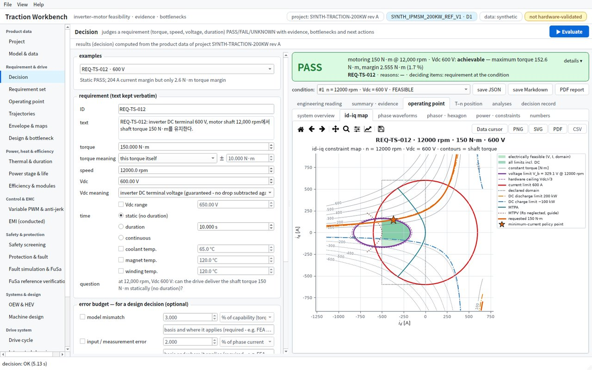 | 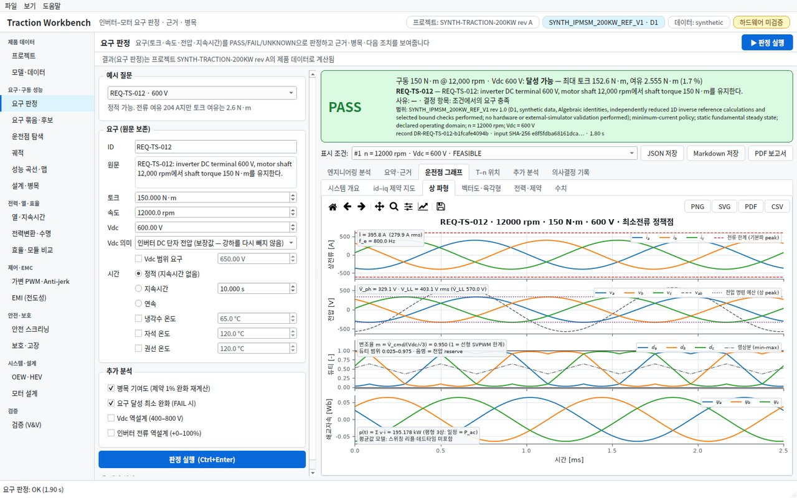 |
| **id–iq 제약 지도**: 전압 타원(명령 예산·하드웨어 상한), 전류원, 선언 도메인, DC 방전/충전 한계, 등토크선, MTPA, MTPV(참고), 요구 토크 곡선, 최소전류 정책점, 전기적/DC 포함 가능 영역 | **상 파형**: 역 Park로 복원한 상전류, 상/선간 전압과 명령 예산, SVPWM 상 듀티(min-max 영상분, 평균값 모델)와 전압 reserve 대역, 쇄교자속, p(t) = P_ac 확인 |
| 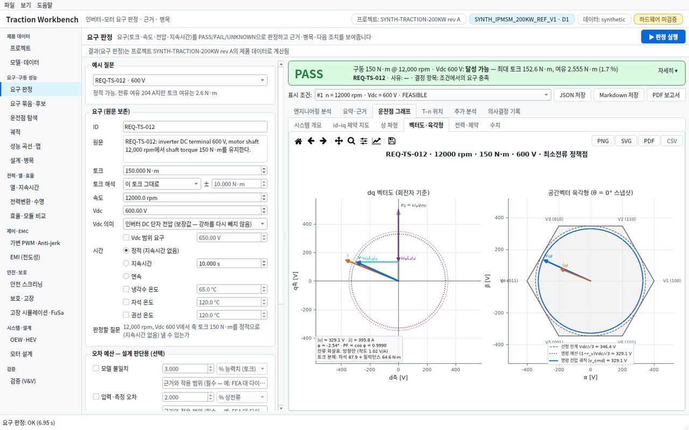 | 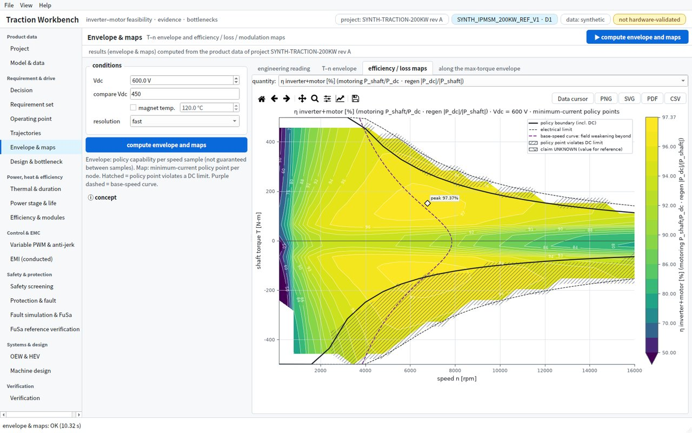 |
| **dq 벡터도**: e₀ = ω_eψ_PM, ω_eL_d·i_d(약계자 전압), −ω_eL_q·i_q, R_s·i, v와 전류각·φ·역률·자석/릴럭턴스 토크 분해 / **공간벡터 육각형** | **효율·손실 맵**: 최소전류 정책점 기준 η, 정책 경계·전기적 한계, 기저속도 곡선, DC 한계 위반 영역(빗금), 최고 효율점 |
| 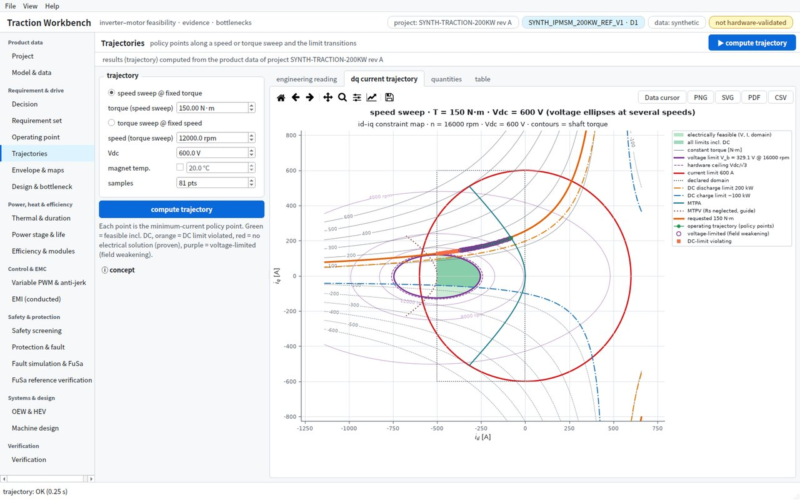 | 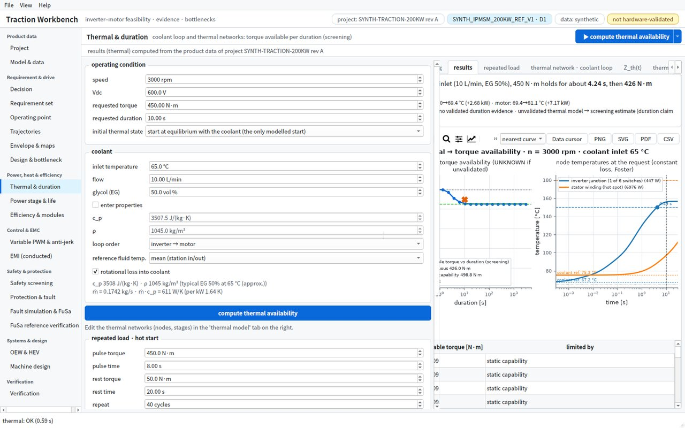 |
| **운전 궤적**: 속도가 오르며 MTPA에서 전압 타원을 따라 약계자로 이동하는 경로, DC 한계 위반점 | **열 → 토크 가용성**: 지속시간별 가용 토크와 노드 온도 궤적(노드별 냉각수 기준 온도 표시) |
| 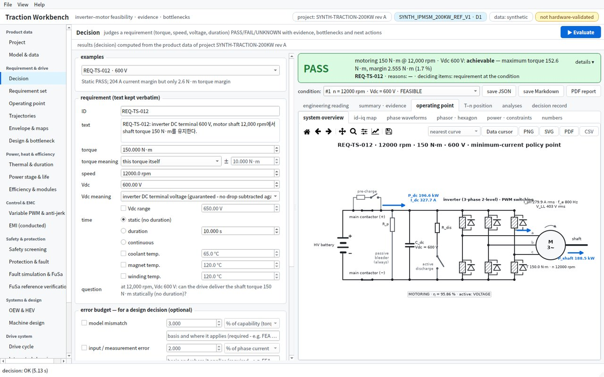 | 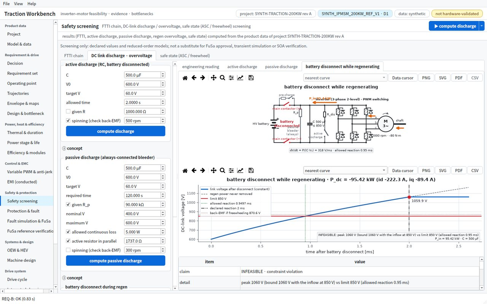 |
| **시스템 개요도**: 배터리–메인 릴레이(프리차지)–DC 링크–능동 방전–3상 브리지–모터–축, 운전점의 P_dc·I_dc·I_ph·V_LL·토크·효율과 전력 흐름 방향 | **회생 중 배터리 차단**: 릴레이 개방(빨강)과 회생 전력이 커패시터로만 들어가는 경로, 아래에 V(t)와 허용 반응 시간 |
| 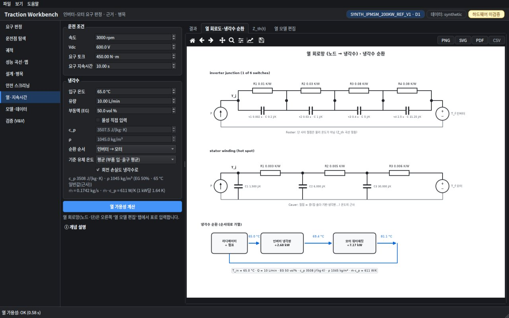 | 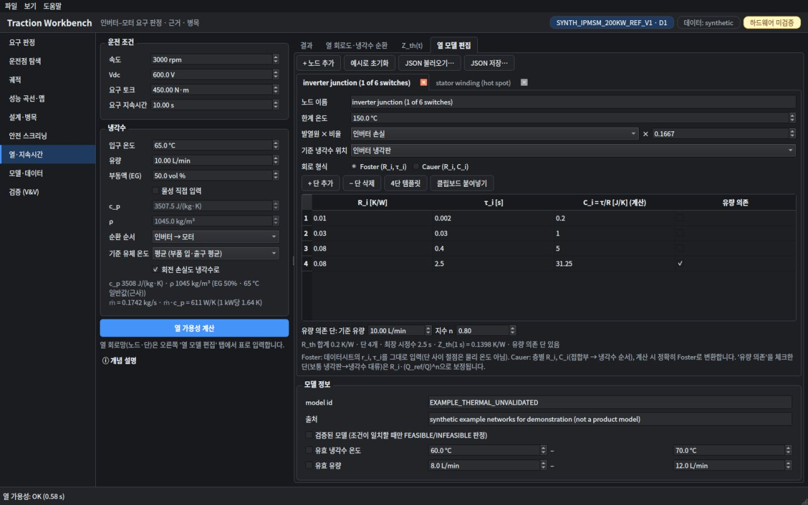 |
| **열 회로망**: Foster(병렬 RC 직렬)·Cauer(사다리) 회로도와 냉각수 순환(라디에이터·펌프 → 인버터 냉각판 → 모터 워터재킷, 각 지점 온도) | **열 모델 편집**: 노드별 발열원·비율·냉각수 위치, 단 표(R, τ 또는 C, 계산된 C 또는 R·C, 유량 의존), 4단 템플릿, 붙여넣기 |

그래프는 production 모델 값을 그대로 다시 표현한 것입니다(새 물리 없음). 파형·듀티는 스위칭 리플·데드타임이 없는 평균값 모델이며
그림과 보고서에 그렇게 표기됩니다. 테스트가 역변환·전력 항등식·MTPA 접선 조건·기저속도 = 약계자 개시점을 독립적으로 확인합니다.

## 무엇이 다른가

- **판정 항목을 섞지 않습니다.** 전기적 해의 존재 / 최소전류 정책의 정적 달성(DC 한계 포함) / DC 소스 한계 / 임의 제어로의 가능성(진단) / 지속시간 / 요구 전체(AND 집계)를 각각 FEASIBLE·INFEASIBLE·UNKNOWN과 근거(evidence)로 보고합니다.
- **INFEASIBLE은 증명이 있을 때만.** 상수 모델은 제약 다항식 근 전수 열거(exact enumeration), flux map은 셀 구간 경계(branch & bound), 공통으로 해석적 필요조건(예: 축 출력 > 방전 한계, 최대 손실로도 충전 한계 미달, d축 전압 하한 > 예산)을 사용합니다. Solver가 해를 못 찾은 것은 UNKNOWN(NUMERICAL_UNRESOLVED)입니다.
- **Capability는 달성값과 증명된 반대쪽 상한을 분리합니다.** 구동 capability는 Lagrangian 오목 상한(상수 모델) 또는 셀 경계(flux map)로 certified, 회생 경계는 최소전류(에너지 회수) 정책 경계로 표본 증거와 함께 보고하며 의도적 손실 증가 운전은 채택하지 않습니다.
- **입력을 조용히 채우지 않습니다.** 단위·정의(peak/RMS, 상/선간, 기계/전기 속도, per-phase/line-to-line, Ke/Kt convention)가 모호하면 계산 전에 INVALID_INPUT, 누락된 손실/온도/지속시간 근거는 UNKNOWN으로 남깁니다. 모든 변환은 기록됩니다.
- **요구를 바꾸지 않습니다.** 원문 보존, 토크 clip 없음, Vdc 범위 요구는 표본점 통과만으로 PASS가 아니며(SAMPLED_COVERAGE), 지속시간이 없으면 정적 항목으로만 해석합니다.
- **결측은 무제한이 아닙니다.** 선언되지 않은 DC 한계·손실·열 증거·초기 상태는 UNKNOWN이고, 무제한은 명시적으로 선언해야 합니다(∞). 스크리닝(EMI, 안전 상태, 합성 데이터)은 PASS로 승격되지 않습니다.
- **모든 witness는 같은 gate를 통과합니다.** 수치 residual·진단값·표본점은 원 요청으로 재검증된 witness가 아니면 증거가 아닙니다. 수학 · 모델 · 요구 · qualification 층은 따로 보고합니다.
- **효율은 경계와 방향을 밝힙니다.** η는 선언된 포트 사이에서만 정의되며, 혼합 흐름은 N/A, 미상 손실은 UNKNOWN, η > 1은 clamp 없이 INCONSISTENT로 남깁니다. 감속기 데이터가 없으면 eDrive η는 100%가 아니라 UNKNOWN입니다.

## 대표 결과 (합성 fixture, 앱의 “예시 질문” / `twb demo`)

| 요구 | 판정 | 핵심 근거 |
|---|---|---|
| 12,000 rpm · 150 N·m · 600 V | **PASS** (정적) | 전류 여유 204 A지만 토크 capability 여유는 **2.555 N·m** — 한계는 전압·DC 방전 전력 (certified 152.555 N·m) |
| 같은 요구 · 450 V | **FAIL** | 필요조건 증명: \|v_d\| ≥ 255.54 V > 예산 246.82 V, 축 출력 188.5 kW > 450 V×400 A. 인버터 전류를 1200 A로 키워도 해결 불가, **Vdc ≥ 497.7 V** 필요 (전압 + DC 전류 공동 병목) |
| 같은 요구 · 10초 유지 | **UNKNOWN** | 전기적으로 가능하나 검증된 10초 rating/열모델 없음 (UNVALIDATED_DURATION) |
| 12,000 rpm · −80 N·m 회생 | **PASS** | 에너지 회수 회생, 충전 한계 내 |
| 12,000 rpm · −100 N·m 회생 | **FAIL** | 최대 손실(600 A)로도 P_dc ≤ −111.3 kW < −100 kW: 배터리 수용 한계 |
| 6,000 rpm · 350 N·m | **FAIL** | 손실 0이어도 축 출력 219.9 kW > 방전 200 kW |
| Vdc 550–650 V 전 구간 · 100 N·m | **UNKNOWN** | 표본 5점 모두 가능하지만 연속 구간 보장은 아님 (SAMPLED_COVERAGE) |
| 정지 · 300 N·m | **PASS** (정적) | 등가 정현파 RMS, 효율 N/A, 정지 열 지속시간 추론 없음 |

## 개발·빌드

```bash
pip install -e '.[gui,test]'          # numpy, scipy + PySide6-Essentials, matplotlib (+ pytest)

twb gui                               # 데스크톱 앱 (= traction-workbench)
twb evaluate examples/cases/req_ts_012_450V_sizing.json --out out/   # 의사결정 기록 JSON + Markdown
twb report   examples/cases/req_ts_012_450V_sizing.json --pdf out/report.pdf   # 그래프 포함 PDF 보고서
twb demo | solve | forward | capability | curve | acceptance
twb selftest out/selftest             # 모든 페이지 headless 자체 검사 (스크린샷 + selftest.json)
twb exchange out/exchange.json        # MathWorks 이식용 교환 패키지: 규약·식별자·도메인·fixture (구현 검증, 물리 검증 아님)
twb project show|check [P.json]       # 프로젝트 데이터 패키지: 식별(섹션 digest·provenance) / 섹션 간 일관성 (기본: 내장 합성 프로젝트)
twb project diff A.json B.json        # 개정 비교: 바뀐 섹션·경로와 영향받는 분석
twb project export out/project.json   # 내장 합성 프로젝트를 편집용 파일로
twb datasheet examples/datasheets/module_example.json --out out/p.json --revision B   # 데이터시트 → 프로젝트 섹션
twb mathworks export out/mw [--project P.json]   # MathWorks 이식 패키지 (twb-mathworks/1)
twb mathworks run out/mw [--runtime octave]      # 로컬 MATLAB(-batch) / GNU Octave에서 twb.runAll → 보고서 재수입
twb mathworks verify out/mw --project P.json     # 대상 보고서 재수입: 이 패키지·이 설계 개정에만 연결, case 재계산

python verification/independent_fixture_check.py      # production 코드를 쓰지 않는 독립 검산
QT_QPA_PLATFORM=offscreen python -m pytest -q

# 실행 파일 (Windows: packaging\build_windows.bat)
pip install -e '.[gui,build]'
python packaging/build.py             # dist/TractionWorkbench/ + zip; 동결 앱에서 acceptance와 self-test 실행
```

CI(`.github/workflows/build.yml`): Linux에서 독립 검산 + 전체 테스트, **MathWorks 이식 패키지를 GNU Octave로 실행**(MATLAB 코드의 parity·
심은 결함 검출·guard — MATLAB/Simulink 단계는 NOT_RUN으로 남음), Windows에서 PyInstaller 빌드 → **동결된 exe로 acceptance·self-test** →
zip 아티팩트 업로드(`v*` 태그면 GitHub Release에 첨부).

## MathWorks 이식 (`twb-mathworks/1`)

Python Workbench를 **실행 가능한 reference 구현**으로 보고, 그 모델·파라미터·시나리오·계산 의미·결과를 MATLAB / Simulink /
System Composer에서 같은 의미로 재현하게 하는 패키지입니다(프로젝트 페이지 → *MathWorks 이식 패키지…*, 또는 `twb mathworks`).
세 층을 분리합니다: **(1) 요구·수용된 원천**(참조 패키지 golden, 계약 수식, map 정의) · **(2) Python reference** · **(3) MathWorks**.
각 비교 case는 (2)의 값과 (1)의 oracle 값을 함께 가지며, 대상은 둘 모두와 비교됩니다 — Python을 절대 기준으로 보지 않습니다.

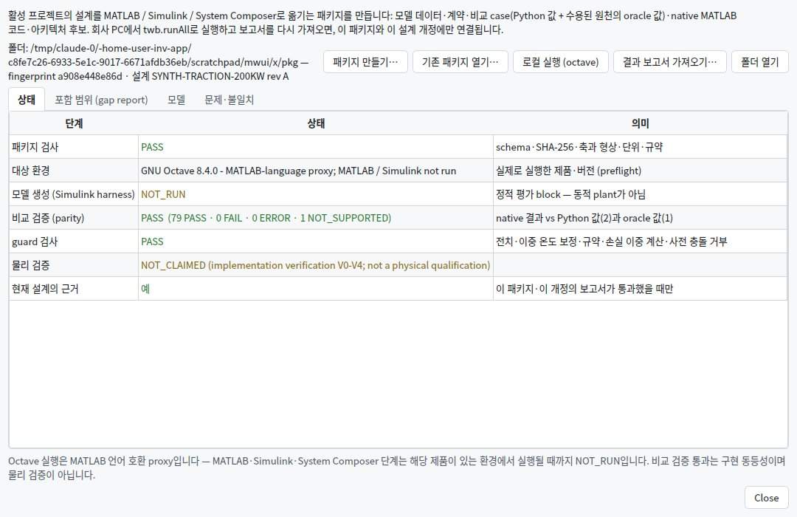

- **옮기는 것**: 프로젝트(twb-project/1)와 교환 패키지(twb-exchange/1)를 그대로, 모델 데이터(단위가 키에 있는 파라미터, 온도 법칙, flux
  plane·mask·축, 손실 closure와 **손실 소유권**, 모델 content SHA-256·provenance), 규약(검사 가능한 열거값), 물리량 사전·tolerance class·
  상태 어휘, 비교 case(forward 48 · flux lookup 21 · 요구 witness 11: ±속도·구동/회생·정지·전압/전류/DC/도메인 경계 ±0.5/±2 tol·
  map 구멍·모서리·축 밖·온도 plane·q-odd), gap report, System Composer/SLDD 후보(stable ID), 사람용 이식 안내와 agent 작업표.
- **MathWorks에서 재현되는 것**: native MATLAB `+twb` — 정상상태 dq forward 평가(상수 dq·flux map, 제약 상태, 에너지 모드, 항등식,
  evidence gate), plane 선택·온도 보간, 요구 witness 재검사(FEASIBLE claim), `twb.runAll`(preflight → 패키지 검사 → parity → guard →
  Simulink가 있으면 정적 평가 harness). 최적화기·인증서·열·PWM 등은 데이터·근거 수준으로만 전달(gap report).
- **같은 의미인지 확인하는 방법**: `|q_t − q_r| ≤ atol + rtol·max(|q_t|,|q_r|)`(물리량 class별) + 상태의 완전 일치, 대상 결과를 Python이
  **다시 계산**해서 판정(보고서의 자기 판정을 믿지 않음), 심은 결함(토크 계수·모서리 규칙·clip·결측=무제한·ACTIVE=위반)이 잡히는지 CI가 확인.
- **연결 유지**: semantic fingerprint와 소비 파일 SHA-256으로 보고서를 그 패키지에만, project digest로 그 설계 개정에만 연결(다른 개정은
  stale). 생성 파일을 편집하면 재생성이 멈추고, 회사 소유물(profile·architecture·dictionary·상세 모델)은 패키지 밖에 둡니다.
  자세한 내용: 패키지의 `README.md`, [`docs/RELEASE_NOTES.md`](docs/RELEASE_NOTES.md) 0.5.0, [`docs/TRACEABILITY.md`](docs/TRACEABILITY.md) 11절.

## 저장소 구조

```
reference/traction_workbench_spec_v1/   불변 설계 기준선 + golden JSON (manifest SHA-256)
src/traction_workbench/
  models/ physics.py solvers/ analysis/ extensions/ decision.py report.py io.py units.py   ← 엔진 (numpy, scipy)
    models/                드라이브 모델: 모터·인버터·자속, 데이터시트 모듈 손실(module_loss.py — 커널이 평가, 2차 surrogate와 배타)
    physics.py             커널: 정방향 평가·제약, 손실 계약(loss_kind · i2_dc · pointwise_loss) — DC 논증의 분기는 여기 한 곳
    solvers/gate.py        공통 witness gate (모든 경로)
    analysis/              역설계·병목·불확실성·정격, efficiency.py(다섯 경계·감속기·미션·모듈 A/B), machine_design.py
    extensions/            timing·dclink·safe_state·thermal·coolant (스크리닝), dclink_ripple·lifetime (P1-A),
                           protection·asc_transient (P1-B), emi (P1-C), oew·hev, pwm_policy (가변 PWM), driveline (anti-jerk)
  exchange.py    교환 패키지 twb-exchange/1 (규약·fixture) — 이식 패키지가 그대로 포함
  mathworks/     MathWorks 이식 패키지 twb-mathworks/1: contract(규약·물리량 사전), oracle(엔진 비의존 층-1 값), cases, architecture
                 (System Composer/SLDD 후보), package(export·check·run·verify), matlab/+twb (native MATLAB 코드)
  datasheet.py   데이터시트 가져오기 (디지타이즈 곡선·ESR·dv/dt → 프로젝트 섹션)
  project.py     프로젝트 데이터 패키지 (twb-project/1): 섹션 검증·digest·일관성 규칙·개정 비교·결과의 사용 기록
  examples.py    내장 합성 프로젝트 — 모든 페이지 예시의 제품 데이터 출처 (api.example(name, project)로 합성)
  modulation.py  변조 법칙 하나 (SVPWM·SPWM·DPWM1 듀티·영상분) — 손실·EMI·리플·샘플링·그림이 공유
  validation.py  입력 숫자·구간·축 검증 (모든 층이 공유)
  viz/           그래프 데이터: 파형·벡터도·육각형·전력 흐름 / 스윕·곡선 / 맵·기저속도 / 설계 / 스크리닝·Z_th 곡선
  plots/         matplotlib 그림과 회로 개요도·열 회로도 (앱과 PDF 보고서 공용)
  desktop/       PySide6 앱: main_window, pages/, 열 모델 표 편집기, 백그라운드 작업, self-test
  report_pdf.py  PDF 엔지니어링 보고서
  api.py service.py cli.py
packaging/       PyInstaller spec, launcher(TractionWorkbench.exe + twb.exe), build.py, 아이콘
verification/    independent_fixture_check.py (production 비의존), make_report.py, make_module_anchor.py (모듈 모델 코어 경로 회귀 기준)
tests/           골든·의미론·검증·리뷰 재현(P0-A/B)·확장·P1·OEW/HEV·EMI·효율·PWM·드라이브라인·모터 설계·교환·보고서·데스크톱,
                 아키텍처(층 base < models < kernel < engines < services < presentation, 지연 import 포함·비공개 결합·순환)
examples/        case 파일, 단위가 선언된 drive 정의, datasheets/ (가져오기 spec 예시 — 가상 부품)
docs/            RELEASE_NOTES.md (모델 계약·한계), TRACEABILITY.md (리뷰·추가 명세 추적표), VERIFICATION_REPORT.md, screenshots/
```

## 검증 상태

- 참조 패키지 10개 파일 SHA-256 일치, 독립 검산 136/136, production vs golden 21/21, pytest 662 통과, 데스크톱 self-test 57/57,
  Windows CI에서 동결된 exe로 acceptance·self-test 통과 — 상세: [`docs/VERIFICATION_REPORT.md`](docs/VERIFICATION_REPORT.md)
- MathWorks 이식 패키지: 패키지의 MATLAB 코드를 **GNU Octave 8.4**(MATLAB 언어 호환 proxy)로 실행해 79 PASS · 0 FAIL · 0 ERROR ·
  1 NOT_SUPPORTED, guard 6/6, 심은 결함 9종 모두 검출. **MATLAB 본체·Simulink·System Composer는 실행하지 않았습니다**(NOT_RUN).
- **합성 fixture에 대한 verification입니다.** 하드웨어·공급사 데이터·외부 시뮬레이터 validation은 수행하지 않았습니다(V4–V5 미수행).

## 문서

- [`docs/RELEASE_NOTES.md`](docs/RELEASE_NOTES.md) — 변경 사항, 실행 방법, model contract, 제약 목록, 판정 의미론, 수치 방법, 알려진 한계, 미구현 항목, data provenance, 재현 조건, 스펙 조항 ↔ 구현 ↔ 테스트 추적표
- [`docs/TRACEABILITY.md`](docs/TRACEABILITY.md) — 독립 리뷰(F01–F13, P0-B/C, P1, §10–§14)·감사 재현·추가 명세(OEW/HEV, 모듈 효율, 가변 PWM·anti-jerk) 항목별 구현·확인·상태(implemented / partial / missing / evidence_missing)
- [`docs/SYSTEM_REVIEW.md`](docs/SYSTEM_REVIEW.md) — 기능 간 의존성·변경 영향·성숙도(V0–V6)·전체 맥락 검토, 교차 모듈 일관성 규칙, 남은 위험과 권고
- [`docs/VERIFICATION_REPORT.md`](docs/VERIFICATION_REPORT.md) — 자동 생성 검증 보고서
