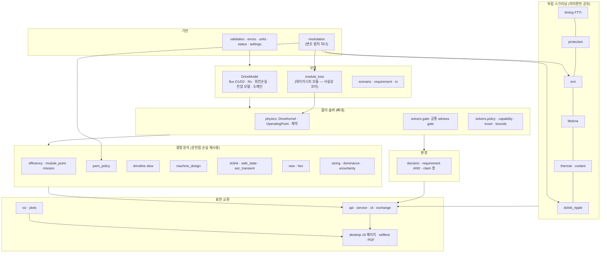

# 시스템 검토 — 의존성·영향·성숙도·전체 맥락 (0.3.0)

구현한 기능이 많아져서, 기능 **사이의** 의존성과 영향, 각 기능의 성숙도, 전체가 하나의 도구로서 일관된지를
한 번에 검토했습니다. 방법은 추측이 아니라 측정입니다:

- 패키지 전체(105 모듈, 약 32,000줄)의 **정적 import 그래프** — 함수 안의 지연 import까지 포함 — 에서 허브, 층 위반,
  순환, 다른 모듈의 비공개(`_name`) 함수 사용을 계산했습니다.
- 같은 물리를 계산하는 **중복 구현**을 찾아 같은 입력에서 **수치로 비교**했습니다.
- 판정 어휘와 "결측 ≠ 무제한" 규칙이 모든 분석에서 지켜지는지 **감사**했습니다(결측 입력이 조용히 통과로 바뀌는 곳 탐색).
- 페이지마다 따로 있는 **예시 데이터**가 서로 모순되지 않는지 교차 확인했습니다.

발견한 결함은 이번 검토에서 고쳤고(6절), 구조 문제는 영향 범위와 함께 권고로 남겼습니다(5절). 권고 R1은 이행했습니다(7절).

## 0. 요약

| # | 발견 | 종류 | 조치 |
|---|---|---|---|
| 1 | 전류 루프 위상 여유를 **설계 인덕턴스 하나**(평균 300 µH)로만 계산 — 기계의 d축(200 µH)에서는 같은 이득의 교차 주파수가 높아져 8 kHz 여유가 55.3°가 아니라 **38.3°** (45° 요구 미달) | 결합 누락 → 낙관적 판정 | **수정**: 축별 이득 설계 + 플랜트 = 운전점의 기계 차동 인덕턴스, 두 축 모두 판정 |
| 2 | 한 PWM 평가 안에서 **손실은 모듈 데이터의 변조**, 리플·샘플링은 페이지의 변조 → 서로 다른 펄스 패턴 | 교차 모듈 불일치 | **수정**: 정책의 변조 하나로 통일, 미지원 변조는 명시 오류 |
| 3 | 미션 에너지에서 포트 전력이 없는 구간을 빼고 **남은 구간의 비율을 미션 효율로 표시** | 조용한 부분 결과 | **수정**: 미션 방향 효율은 UNKNOWN, 부분 비율은 별도 표기 |
| 4 | 같은 예시 IGBT 모듈의 접합→냉각수 열저항이 페이지마다 **0.09 / 0.17 / 0.20 K/W** | 예시 데이터 불일치 | **부분 수정**: 효율·PWM·수명 페이지를 한 열 경로로 통일; 열 페이지는 다른 추상화(스위치 평균)로 명시 |
| 5 | 변조(듀티) 법칙이 엔진에 **3벌**(+ 그림 1벌) — DPWM1은 섹터 경계 동점 처리까지 서로 다름 | 중복 물리 | **수정**: `modulation.py` 하나로 통합(구 구현과 1e-16 일치 확인) |
| 6 | 다른 모듈의 비공개 함수 사용 **51곳**(패키지 경계를 넘는 것 33곳); 모든 확장이 숫자 검증 하나 때문에 **자속 모델 모듈**에 의존 | 숨은 결합 | **수정**: `validation.py`, 공개 이름 — 51 → 13(패키지 경계 넘는 것 **0**), 자속 모듈 의존 29 → 11 |
| 7 | 코어 `physics`가 `extensions.module_loss`를 import — **"확장"이 사실상 코어**: 변경 시 영향이 physics와 같은 30개 엔진 모듈 | 층 위반·숨은 허브 | **수정 (R1, 7절)**: 모델 층·타입 계약·커널 손실 계약, 회귀 기준, 아키텍처 테스트 |
| 8 | 프로젝트 단위 데이터셋이 없음 — 드라이브·모듈·열·제어기·구동계 예시가 페이지마다 독립 | 맥락 일관성 | 권고 R2 |
| 9 | 모든 수치 fixture는 구현 검증(V0–V3); 물리 검증(V4–V6)은 전 영역에서 없음 | 성숙도 | 4절 매트릭스, 권고 R8 |

## 1. 전체 맥락

도구의 뼈대는 **정상상태 기본파 dq 모델 위의 판정 엔진**입니다. 나머지는 모두 이 뼈대의 운전점·손실·판정 의미론을 재사용하거나(결합 분석),
독립된 입력으로 같은 판정 의미론만 공유합니다(독립 스크리닝).

**가장 중요한 결합 경로** (여기가 바뀌면 여러 페이지의 결론이 같이 바뀝니다):

1. `module_loss` → `physics`(P_dc) → 모든 DC claim·capability·sizing·지도 → 효율(module_point) → PWM 정책·모듈 A/B → 수명.
2. `modulation` → 모듈 손실 · EMI 엣지 스펙트럼 · DC-link 커패시터 전류 · PWM 리플·샘플링 창 · 운전점 그림.
3. `physics`/`solvers` → 판정 전체(golden acceptance와 production 비의존 독립 검산이 지키는 영역).
4. 예시 데이터(`api.EXAMPLE_*`) → 데스크톱 페이지 기본값과 self-test의 회귀 기준(예: "평가 후보 중 최선 = light-load 8 kHz").

## 2. 의존성·영향

### 2.1 허브 (많이 의존되는 모듈)

| 모듈 | 직접 의존 | 전이 의존(엔진 쪽) | 의미 |
|---|---:|---:|---|
| `physics` | 22 | 30 | 뼈대. 변경 = 전체 재검증 (golden + 독립 검산) |
| `models.module_loss` (구 `extensions.module_loss`) | 3 | 30 | 커널이 평가하는 드라이브 모델의 일부 — 이제 위치·타입·회귀 기준(`module_core_anchor`)이 이 영향 범위와 일치 (R1) |
| `solvers.gate` | 5 | 30 | 공통 witness gate. physics와 지연 순환 (2.2) |
| `solvers.policy` | 18 | 17 | 최소전류 정책 — 결합 분석 대부분의 운전점 |
| `models.flux` | 29 → **11** | 46 → 전이는 physics 경유로 유지 | 숫자 검증만 쓰던 18개 모듈을 `validation`으로 분리 |
| `api` | 14 | (데스크톱) | 예시 + 파싱 + 라우트 1,787줄 — UI의 허브 (R5) |

### 2.2 층 위반·순환 (정적 그래프, 지연 import 포함)

- 모듈 수준 순환: **없음**. 지연 import 순환 1개: `physics ↔ solvers.gate` (gate는 사실상 physics 층; 동작은 정상).
- 위쪽 의존: 검토 당시 `physics → extensions.module_loss` (R1) — **수정 후 0**. 층은 base(errors·status·settings·units·validation·modulation)
  < models(models·scenario·requirement) < kernel(physics·solvers) < engines(analysis·extensions) < services(io·exchange·service·decision·report·api)
  < presentation(plots·viz·report_pdf·desktop·cli)이며, 입력 어댑터 `io`와 진입점 `cli`는 각각 services·presentation 층이라
  `io → analysis.rating`, `cli → desktop`은 위반이 아닙니다. `tests/test_architecture.py`가 이 층 규칙(지연 import 포함)과
  모듈 수준 순환 0을 강제합니다.

### 2.3 비공개 결합

| | 이전 | 이후 |
|---|---:|---:|
| 다른 모듈의 `_name` import | 51 | 13 |
| 그중 패키지 경계를 넘는 것 (analysis ↔ extensions ↔ plots …) | 33 | **0** |
| 다른 패키지 모듈의 `_name`을 속성으로 사용 (`api._case` 등, R1 때 추가 측정) | 5 | **0** |
| `models.flux`를 import하는 모듈 | 29 | 11 |

남은 13개는 같은 패키지 안의 그림 도우미(`plots.figures._note/_reset`, `viz.sweeps._tick`)와 데스크톱 내부 1개입니다(R6).
데스크톱이 속성으로 쓰던 API 파서 4개는 공개 이름이 되었습니다(`case_from_body`, `thermal_model_from_dict`, `thermal_network_from_dict`,
`driveline_from_dict`; 구 이름은 별칭). 패키지 경계를 넘는 비공개 이름 0은 아키텍처 테스트가 강제합니다.

### 2.4 중복 물리

| 계산 | 이전 | 이후 | 비고 |
|---|---|---|---|
| 변조 법칙(듀티, 영상분) | module_loss · emi · dclink_ripple · viz 4벌 | `modulation.py` 1벌 | SVPWM/SPWM 1e-16 일치; DPWM1은 섹터 경계(θ = 90°, 270°)의 **동점 처리만** 달랐음(두 선택 모두 유효) — 이제 모든 소비자가 같은 선택 |
| 역기전력 / 무부하 자속 | dclink 1벌 (safe_state·machine_design이 재사용) | 동일 | 중복 없음 |
| 모듈 전기열 고정점 | efficiency 1벌 (PWM이 재사용) | 공개 `module_point` | 중복 없음 |

## 3. 의미론 일관성

### 3.1 판정 어휘

모든 모듈은 최종적으로 FEASIBLE / INFEASIBLE / UNKNOWN 한 체계로 귀결되며, 모듈별 어휘는 그 **위의 세부 표현**입니다.

| 어휘 | 모듈 | 대응 |
|---|---|---|
| DEFINED · N/A · UNKNOWN · INCONSISTENT | 효율 경계 | N/A = 정의 불성립(혼합 흐름), UNKNOWN = 정의 가능하나 미확립, INCONSISTENT = η > 1 (clamp 없음) |
| ADMISSIBLE · VIOLATION · UNKNOWN | PWM 정책 | 이번 수정 전에는 요구 미확립 구간도 VIOLATION이었음 → UNKNOWN으로 분리 |
| OK · VIOLATION · UNKNOWN | 전류 샘플링 | 선언 한도 없으면 UNKNOWN |
| A_LOWER_LOSS · B_LOWER_LOSS · UNDECIDED · NOT_COMPARABLE | 모듈 A/B | 선언 오차 예산을 넘을 때만 우열 |
| IMPROVED · WORSE · UNDECIDED | PWM 모터+인버터 합 | 구간 비교 (고조파 철손 상한) |
| PASS · FAIL · INDETERMINATE | EMI 측정 trace | 측정 판정만; 스크리닝은 PASS가 아님 |
| SCREENING_PASS / SCREENING_FAIL | ASC 과도의 **항목** | 항목 표시일 뿐 joint claim은 항상 UNKNOWN (이름이 오해될 수 있어 기록) |
| REQUIREMENT_INCOMPLETE | EMI · ripple · ASC | 요구 정의 불완전 → UNKNOWN 사유 |

### 3.2 "결측 ≠ 무제한" 감사

입력이 없을 때 검사를 건너뛰는 모든 위치(`if x is None: continue` 류)를 확인했습니다. 대부분은 UNKNOWN·미검증 목록으로 올바르게
보고합니다(HEV 결합 집합, 수명의 미포함 사이클, 정격 envelope 조건, 모듈 손실 표 커버리지). 이번 작업 동안 발견해 고친 위반:

- 드라이브라인 토크 창 미선언 → 이전: 클리핑 없이 통과 가능 / 이후: UNKNOWN (7ca1821)
- PWM 요구 미확립 구간 → 이전: 위반 / 이후: UNKNOWN (7ca1821)
- 미션 효율의 부분 비율 → 이전: 미션 효율로 표시 / 이후: UNKNOWN + 부분값 별도 (이번 검토)
- 모듈 데이터가 운전점을 덮지 못할 때(스위칭 시험 전압 밖, 스케일링 법칙 미선언)의 DC claim 사유 → 이전: "손실 모델 없음"(MISSING_INPUT) /
  이후: 모듈 손실 미확립 + 모델의 문제 목록(OUTSIDE_MODEL_DOMAIN) (R1-1)
- 격자 위 DC 판정(id–iq 지도의 '모든 한계', 격자 envelope) → 이전: 모듈 모델에서 격자 P_dc(NaN)를 위반으로 비교해 '모든 한계 만족 영역 없음',
  'DC 가능 점 없음' / 이후: '격자 미평가'(None)와 사유, DC는 정책점에서 판정 (R1-2)

### 3.3 교차 모듈 일관성 규칙 (이번 검토로 명시)

1. **한 평가 = 한 펄스 패턴**: 손실·리플·샘플링·커패시터 전류는 같은 변조로 계산합니다(`module_modulation`에 선언값/사용값 기록).
2. **한 모듈 = 한 열 경로**: 같은 모듈을 쓰는 페이지(효율·PWM·수명)는 같은 접합→냉각수 경로를 씁니다(예시의 Foster 합 = 모듈 Rth).
3. **설계값 ≠ 플랜트**: 제어기 이득은 선언 설계 인덕턴스로, 판정은 운전점의 기계 차동 인덕턴스로 — 두 축 모두.
4. **손실 모델 계약 하나** (R1-2): DC 쪽 논증은 커널의 손실 계약으로만 분기합니다 — 2차 surrogate의 폐형식 항등식
   P_dc = T_em·ω_m + (1.5·R_s + a2)·I² + a0 (`i2_dc`: I² 대역, 라그랑지안 DC 제약, 셀 경계, 최대 손실 screen, 격자 P_dc)과
   점별 모델(`pointwise_loss`: 직접 평가한 witness만, 격자에서는 미평가). 이전에는 같은 식이 7곳에 복제되고 모델 분기가 흩어져 있었습니다.

## 4. 성숙도

검증 단계는 handoff §13.1: V0–V3 = 구현 검증(단위·부호, 해석 기준, 독립 구현, 수렴), V4 = 다른 도구와의 동등성, V5–V6 = 시험·차량 증거.
"독립 기준"은 production 코드가 아닌 방법(폐형식, 교과서 값, 독립 ODE, FFT, 표준 예제)으로 같은 값을 확인하는 테스트입니다.

| 기능 | 독립 기준 (예) | 구현 검증 | API · UI · self-test · 교환 | 물리 증거 | 주요 공백 |
|---|---|---|---|---|---|
| dq 모델·정책·capability (D1) | golden 21건, production 비의존 검산 136건, 50자리 MTPA | **V3** | ● ● ● ● | 합성 | V4–V6 |
| flux map (D2) | manufactured map, 셀 B&B 인증 | V3 | ● ● ● ○ | 합성 | 다중 분기 인증, 동적 qualification |
| 판정·claim 층·요구 AND | 재현 사례 F01–F13, 감사 재현 | V2 | ● ● ● ○ | — | — |
| FTTI 경로 | 경로 열거 사례 | V2 | ● ● ● ○ | 선언값 | 지연값 자체 미검증 |
| 방전·과전압·안전 상태 | 해석해, 브리지 등가 | V2 | ● ● ● ○ | 합성 | 결합 방전 모델, UCG 크기 |
| 열·냉각수 | Cauer ODE 대조, 에너지 수지 | V3 | ● ● ● ○ | 합성 | 검증된 열모델 |
| 모듈 손실 | 이벤트 합 = 평균 손실 (1%) | V2 | ● ● ● ○ | 합성 | DPT·공급사 도구 상관 |
| DC-link 리플 | SPWM 폐형식, Parseval | V2 | ● ● ● ○ | 합성 | 측정 |
| 수명 (rainflow) | ASTM E1049 예제 | V2 | ● ● ● ○ | 공급사 법칙 없음 | 손상 법칙 |
| 보호·ASC 과도 | 행렬지수 vs RK45 | V2 | ● ● ● ○ | 합성 | HIL, 비선형 과도 |
| 전도 EMI | FFT 대조, DM/CM 반회로 폐형식 | V2 | ● ● ● ○ | 스크리닝 | 보정·측정 |
| OEW · HEV | 64 상태 기하, 반경 V/√3, Willis | V1–V2 | ● ● ● ○ | 합성 | OEW 과도 ASC(R-02), R-03 |
| 효율·미션·모듈 A/B | 추가 명세 E-01..E-06 | V2 | ● ● ● ● | 합성 | 열량계·동력계 상관 |
| 가변 PWM | 리플 시간 적분 = 스펙트럼, 단일 션트 창 폐형식, 전환 점프 폐형식 | V2 | ● ● ● ● | 선언 타이밍 | 동기 PWM, dq 결합 과도, 타깃 WCET |
| Anti-jerk | 추가 명세 D-01..D-05, 출력 좌표 독립 ODE | V3 | ● ● ● ● | 합성 ROM | FRF 식별, wheel slip, 다관성 |
| 모터 설계 | 교과서 권선계수, dq 스케일링 항등식 | V2 | ● ● ● ○ | — | FEA/CAD 연계(비목표) |
| 교환 패키지 | 위 fixture를 코드에서 직접 생성 | — | ● ○ ○ — | — | MATLAB 쪽 parity 실행 (V4) |

● 있음 · ○ 해당 교환 fixture 없음. **전체 판단**: 뼈대(dq 모델·판정)는 V3로 가장 성숙하고, 확장 분석은 핵심 식마다
독립 기준을 가진 V2 수준입니다. 물리 검증(V4–V6)은 모든 영역에서 없으며, 예시 데이터는 모두 합성입니다 — 도구는
"선언된 모델에서의 판정"까지만 주장하고, 그 경계를 화면·기록·보고서가 같은 방식으로 표시합니다.

## 5. 남은 위험과 권고 (우선순위)

### 5.1 R1 — `module_loss`를 코어 모델로 (완료, 7절)

데이터시트 모듈 모델은 `InverterModel.module_loss`로 드라이브 모델의 일부이고 `physics`가 직접 평가합니다. 검토 당시 위치만 "확장"이었습니다.
**변경 영향**: 모든 DC claim(정책·capability·sizing·지도), 효율·모듈 A/B, PWM 정책, 수명, OEW 브리지 손실.
**이행**: `models/module_loss.py`(확장 경로는 재수출), 타입 계약, 커널 손실 계약, 모듈 모델 코어 경로 회귀 기준, 아키텍처 테스트.

변경 시 다시 돌릴 것:

| 바꾸는 것 | 재검증 |
|---|---|
| `models/module_loss` | `test_module_core_anchor`, `test_loss_contract`, `test_module_loss`, `test_efficiency`(one-physics), `test_pwm_policy`, `test_lifetime`, `test_oew`, self-test power/efficiency/pwm |
| 커널 손실 계약 (`physics.QuadraticDC`, `loss_kind`) | 전체 + `twb acceptance` + 독립 검산 + `test_module_core_anchor` |
| `modulation` | 위 + `test_emi`, `test_dclink_ripple`, `test_viz` |
| `physics`, `solvers/*` | 전체 + `twb acceptance` + `verification/independent_fixture_check.py` |
| `analysis.efficiency.module_point` | `test_efficiency`, `test_pwm_policy` |
| `api.EXAMPLE_*` | self-test의 예시 기준값(정책 순위, A/B 판정 등) |

### 5.2 R2 — 프로젝트 데이터셋 (높음)

페이지마다 예시가 독립이라, 페이지를 오가며 얻은 결론이 같은 제품 데이터에서 나온 것이라는 보장이 없습니다.
남은 예: 열 페이지의 "스위치 1개 평균" 열망(0.20 K/W)과 모듈 경로(0.09 K/W)는 다른 추상화이고, 드라이브라인 액추에이터 τ(1.5 ms)는
전류 루프 대역(500 Hz)에서 유도되지 않은 별도 선언입니다.
**권고**: 드라이브·모듈·열 경로·제어기·구동계를 ID와 개정으로 묶은 **프로젝트 데이터 패키지** 하나를 모든 페이지가 참조
(P0-B의 qualified machine-data package와 같은 방향). 그 전까지는 예시 간 참조(이번에 Rth에 적용)로 불일치를 줄입니다.

### 5.3 그 밖

- **R3 (중간)** 전류 루프는 축별 선형 PI, 운전점 한 점의 차동 인덕턴스; dq 결합(교차 결합·decoupling)과 dq 과도는 없음.
- **R4 (중간)** self-test가 예시 수치에 묶인 회귀 기준을 가짐 — 의도된 것이지만 예시를 바꾸면 함께 갱신해야 함.
- **R5 (중간)** `api.py`(1,787줄)를 예시(`examples.py`)와 영역별 파서로 분리.
- **R6 (낮음)** 같은 패키지 안의 비공개 도우미(`plots._note/_reset`, `viz._tick`) 공개화.
- **R7 (낮음)** 기존 미사용 import 34개(일부는 재수출일 수 있어 확인 후 정리).
- **R8 (검증)** 첫 "qualified baseline"의 최소 증거: 공급사 기계 데이터 패키지(개정·조건), 모듈 DPT, 열 시험(Z_th), 동력계 효율 맵,
  보호 타이밍 HIL. 이것이 없는 동안 모든 결과는 "선언된 모델에서의 판정"입니다.

## 6. 이번 검토에서 수정한 것

| 수정 | 파일 | 확인 |
|---|---|---|
| 전류 루프: 축별 이득 설계, 플랜트 = 운전점의 기계 차동 L_d/L_q, 두 축 판정, 결속 축 표시; 단일 L 선언은 두 축 모두로 검사 | `extensions/pwm_policy.py` (`axis_loops`, `differential_inductances`, `axis_margins`), `api._loop`, PWM 페이지 | `test_loop_margin_is_checked_on_both_machine_axes` (단일 L: 8 kHz d축 38.3° → 위반) |
| 한 평가 한 변조 (모듈 데이터 변조 대체, 기록), 미지원 변조 명시 오류 | `evaluate_policies` | `test_one_pulse_pattern_for_losses_ripple_and_sampling` |
| 미션 효율: 포트 전력 미상 구간이 있으면 UNKNOWN, 부분 비율 별도 | `analysis/efficiency.mission_energy`, 효율 페이지·그림 | `test_mission_direction_efficiency_is_withheld_...` |
| 예시 열 경로 통일 (수명 Foster 합 = 모듈 Rth, PWM·A/B는 모듈 Rth 참조) | `api.EXAMPLE_MISSION/PWM/EFFICIENCY` | 수명·효율·PWM 테스트 |
| 변조 법칙 통합 | `modulation.py`; module_loss·emi·dclink_ripple·viz | 구 구현과 1e-16 일치, 관련 테스트 124개 |
| 숫자 검증 분리 | `validation.py` (자속 모듈은 재수출) | 전체 테스트 |
| 공개 이름: `module_point`, `edge_lines`, `positions`, `hull`, `jsonable` (구 이름은 별칭) | 해당 모듈 | 전체 테스트 |

## 7. R1 이행 — `module_loss`를 코어 모델로

순서는 "기준을 먼저 고정하고, 옮기고, 기준이 그대로인지 확인"입니다. 기준값은 이동 전후 모두 같습니다
(`module_core_anchor`, golden 21/21, 독립 검산 136/136).

| 단계 | 내용 | 확인 |
|---|---|---|
| R1-1 회귀 기준 | 모듈 모델이 켜진 코어 경로 — 정방향 손실 4점, 정책 해 5건과 claim, capability 3건, 스위칭 시험 전압 밖의 사유, Vdc sizing 경계(선언 스케일링 법칙) — 를 `verification/make_module_anchor.py` → `tests/fixtures/module_core_anchor.json`으로 고정. 구현 회귀 기준이며 독립 기준이 아닙니다 | `test_module_core_anchor` (정방향 상대 1e-9, solver 상대 1e-6 / 1e-4 A, sizing 1e-5 V) |
| R1-1 발견 | 모듈 데이터가 점을 덮지 못할 때 DC·정책 claim 사유가 "손실 모델 없음"(MISSING_INPUT) → 모듈 손실 미확립 + 모델의 문제 목록(OUTSIDE_MODEL_DOMAIN). sizing의 Vdc 주석도 활성 손실 모델에 따름 | 기준의 `unscaled_700V` |
| R1-2 이동·타입 | `models/module_loss.py` (구 경로 `extensions.module_loss`는 PEP 562 재수출), `InverterModel.module_loss: ModuleLossModel`, 두 손실 모델 모두 타입 검사, `InverterModel.loss_kind`; `physics`의 지연 상향 import 제거 | `test_loss_contract`, `test_architecture` |
| R1-2 커널 계약 | `DriveKernel.loss_kind · i2_dc · pointwise_loss · dc_defined · loss_label`; 2차 항등식 7벌(정책 2, 공통 대역, 셀 경계, capability, 인증서, screen) → `QuadraticDC` 1벌; 정책·capability·경계·screen·지도·서비스가 계약으로만 분기 | 기준값 불변; 항등식 = 커널 평가(임의 200점, 1e-12) |
| R1-2 발견 | 모듈 모델에서 id–iq 지도의 '모든 한계 만족' 영역이 항상 비고 격자 envelope가 DC 가능 점을 찾지 못함(격자 P_dc NaN을 위반으로 비교) → '격자 미평가'와 사유(그림 범례 포함). capability는 DC 한계가 witness 직접 검사로만 들어간다고 표시(경계는 전기적 상한 — 여전히 상한). 최대 손실 screen은 적용 불가 사유를 모델 이름으로 | `test_grid_dc_is_not_evaluated_with_a_pointwise_model`, `test_module_model_is_pointwise_everywhere` |
| 아키텍처 테스트 | 층 규칙(지연 import 포함), 패키지 경계 비공개 이름 0(import와 속성 사용), 모듈 수준 순환 0, 모든 모듈의 층 배정 | `tests/test_architecture.py` |

