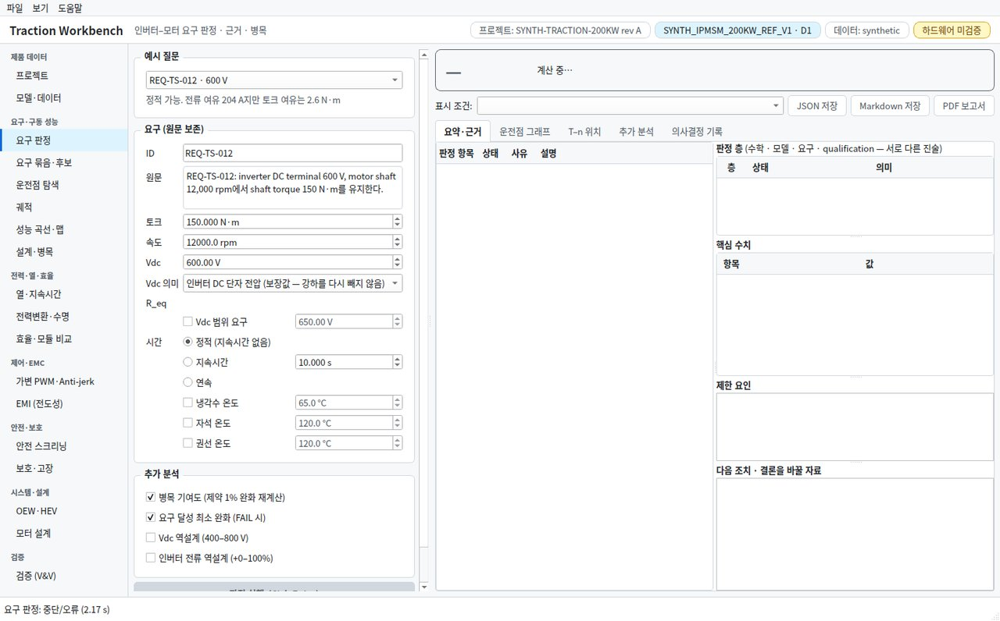
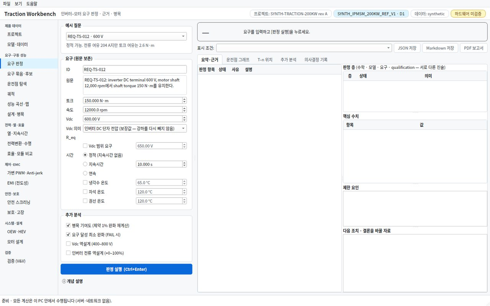
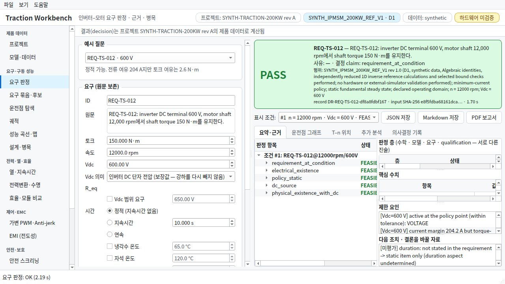
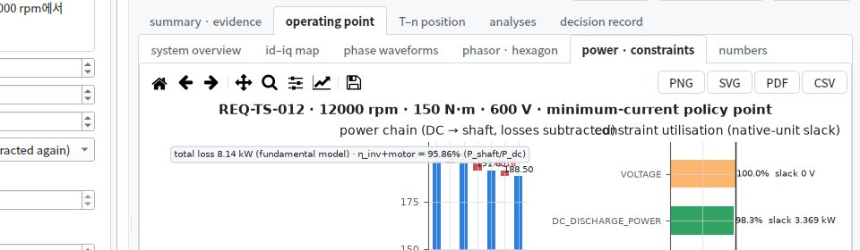
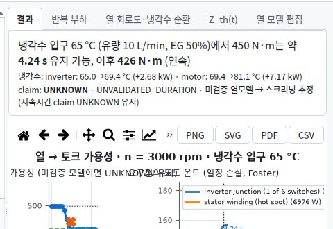
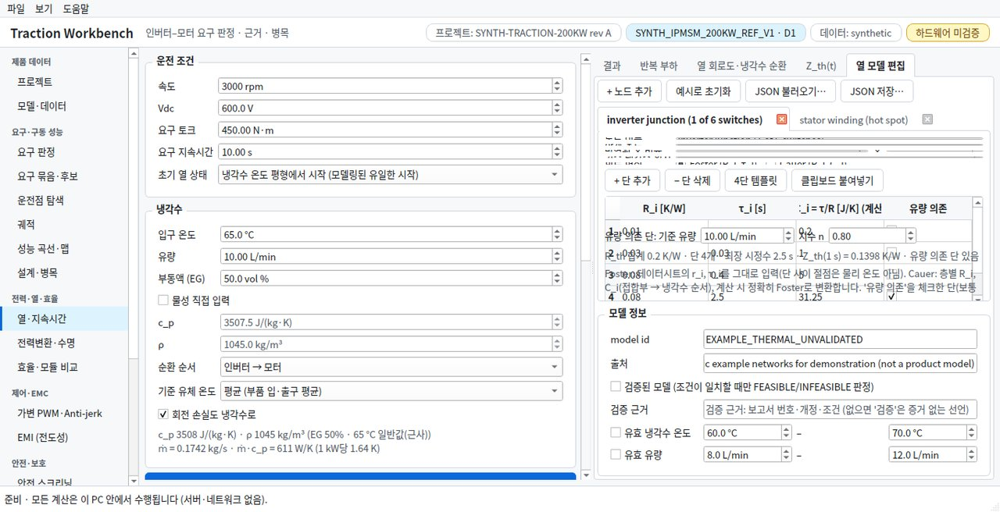

# 데스크톱 앱 사용자 경험(UX) 검토 — 개선·보완 제안

- 기준: `main` 225908b (PR #6 병합 직후), 2026-09-29
- 성격: 검토 당시에는 **문서만 작성했고 코드는 바꾸지 않았습니다.** 모든 항목은 캡처, 코드 위치, 재현 또는 측정 결과를 근거로 합니다. 그 뒤 PR #7에서 고친 내용은 바로 아래 [반영 현황](#반영-현황-pr-7)에 있습니다. 3장의 현상·근거는 검토 당시(225908b)의 기록이므로 고친 항목도 그대로 둡니다.
- 대상: PySide6 데스크톱 앱. 7개 그룹, 19개 페이지와 대화상자(데이터시트 가져오기·값 입력, MathWorks 패키지)를 봤습니다.
- 엔진의 공학적 정확성은 범위 밖입니다(`docs/VERIFICATION_REPORT.md`, `docs/STATUS.md`에서 다룸). 이 문서는 **사람이 이 앱을 쓰는 경험**만 봅니다.

---

## 반영 현황 (PR #7)

P0 3건은 모두 고쳤습니다. 51건 중 **반영 11건, 부분 반영 9건, 미반영 31건**입니다. 검토에는 없던 **엔지니어링 분석**(아래)도 더했습니다. 이 기능은 E1·E4·G1을 결과 해석 쪽에서 함께 다룹니다.

### 반영

| 항목 | 한 일 | 확인 |
|---|---|---|
| [A1](#a1) | 취소하면 페이지를 되돌립니다. 실행 버튼이 다시 켜지고, 배너에 "취소됨"을 표시합니다. 이전 결과가 있으면 그대로 두고 "이전 결과를 표시 중"이라고 적습니다. 다음 실행은 정상입니다. 작업은 결과·오류·취소 어느 경우에도 끝을 알립니다(`TaskRunner.task_finished`) | `tests/test_desktop_run_control.py` |
| [A2](#a2) | 결과는 계산 당시 입력을 기억합니다. 입력(예시 선택 포함)이 바뀌면 결과 위 띠와 판정 배너에 바뀐 항목(이전 → 지금)을 표시하고, 되돌리면 표시가 사라집니다. 판정 기록·보고서 저장 전에는 "이전 입력의 결과"임을 확인받습니다. 결과가 있는 15개 페이지 모두에 적용했습니다 | 같은 테스트(토크 150 → 400, 예시 "저전압 450 V") |
| [A4](#a4) | 보이지 않는 탭의 그래프는 그 탭을 열 때 그립니다. GUI 최대 정지(부록 A-3 방식, 1480×920, 유휴 상태 3회): 판정 **1,430 → 104–154 ms**, 성능 곡선·맵 **884 → 211–319 ms**. 성능 곡선·맵은 5장의 목표(300 ms) 근처입니다(3회 중 1회 초과) | 20 ms 타이머 측정 |
| [A7](#a7) | 모든 페이지의 머리 막대에 공통 실행 버튼을 두었습니다. 보이는 탭의 주 실행을 누르고, 실행이 여러 개면 메뉴로 고릅니다. 실행 중에는 "■ 취소 — 작업 이름"으로 바뀌어 그 페이지 계산만 취소합니다. Ctrl+Enter / Esc도 같은 동작입니다 | 같은 테스트 |
| [H1](#h1) | 열 모델 편집기를 스크롤 영역으로 감쌌습니다. 1366×700, 1280×720, 1100×700에서 입력 칸 높이 24–27 px, R_i / τ_i 표 195 px로 겹침이 없습니다 | 세 크기 캡처·측정 |
| [H2](#h2) | 머리 막대의 ▶ 버튼은 입력 열 스크롤 밖에 있어 창 크기와 관계없이 모든 페이지에서 보입니다(주 실행 버튼 자체는 입력 열에 그대로 있음) | 1280×720 자체 점검 캡처 |
| [D1](#d1) | 소스 저항 R_eq 행(레이블 포함)은 Vdc를 배터리 OCV로 지정했을 때만 보입니다 | 같은 테스트 |
| [A3](#a3) | 취소가 페이지별이고(머리 막대, Esc), 긴 계산 안에서도 바로 멈춥니다. 엔진의 반복(토크 능력 스캔과 경계 이분법, 운전 조건, 역설계 표본과 이분법, 병목 기여도, 요구 완화, 시나리오 비교, 설계 곡선, 트레이드 스터디 후보, OEW 비교 속도점, PWM 선 스펙트럼)이 한 단계마다 취소를 확인합니다(`traction_workbench.progress`). 자속 지도 판정(스레드 실행 약 29 s)에서 [취소]부터 작업이 끝나기까지 스캔 중에는 **0.01–0.06 s**, 시작 직후(스캔 전의 전기적 한계 계산 중)에는 0.44 s입니다. 이전에는 판정 계산이 끝나야 멈췄습니다(3 s에 누르면 26 s 뒤, 20 s에 누르면 9 s 뒤). 취소 신호는 `BaseException`이라 엔진의 넓은 예외 처리(수치 실패 → UNKNOWN, 실패한 검사 → UNKNOWN)가 판정이나 결과로 바꾸지 못합니다. 그래도 계산이 끝까지 가면 그 결과는 버립니다 | `tests/test_progress.py`, `tests/test_desktop_progress.py`, 스레드 실행 측정(이벤트 루프 기준) |
| [E2](#e2) | 판정 배너는 결론, 요구 ID, 사유만 보이고 요구 원문, 한정 조건, 범위, 기록 ID는 **[자세히 ▾]** 로 접힙니다(펼친 상태는 기억). 요약 탭은 스크롤되는 한 열이고, 표는 행 수만큼 높아서 머리글만 남는 일이 없습니다. 1280×720에서 배너 높이 **217–246 → 79–159 px**, "판정 층"·"핵심 수치" 표 **0/4·0/11 → 4/4·11/11행**(창이 짧으면 스크롤) | `tests/test_desktop_run_control.py`, 1280×720·1600×1000 × 한국어·영어 측정 |
| [E4](#e4) | 판정 배너의 첫 줄(그리고 엔지니어링 분석의 첫 줄)이 결론과 그 근거 수치를 한 줄로 말합니다(예: "구동 150 N·m @ 12,000 rpm · Vdc 450 V: 불가능 (증명됨) — 이 조건의 최대 토크 134.9 N·m, 부족 15.11 N·m (10.1 %)"). 범위와 기록 정보는 [자세히]로 접었습니다(E2) | 같은 테스트 |
| [J1](#j1) | **작업 공간 파일**(파일 메뉴 → 작업 공간 열기·저장·다른 이름으로 저장, `*.twb-workspace.json`, 스키마 `twb-workspace/1`). 15개 페이지의 모든 입력(563개 항목, 표·열 회로망·규칙 표는 한 항목), 위젯 없이 엔진에 들어가는 페이지 데이터(측정 EMI 트레이스와 교정 연결, 모듈 곡선 세트, 후보 계보, A/B 모듈 파일), 열린 탭, 프로젝트를 담습니다. 입력은 화면 위치나 레이블이 아니라 페이지의 속성 이름으로 저장하므로, 언어를 바꾸거나 폼 순서가 바뀌어도 값이 다른 칸에 들어가지 않습니다. 복원할 수 없는 값(범위 밖, 목록에 없는 선택, 열이 다른 표, 없어진 칸)은 이름을 들어 알리고 그 칸은 그대로 둡니다. 결과는 저장하지 않습니다(다시 실행하면 같은 입력으로 계산). 사람의 세션에서는 60 s마다와 종료 때 복구 파일을 쓰고, 다음 시작 때 복원할지 묻습니다(거절한 복구는 `.previous.json`으로 남김). 저장하지 않은 작업 공간 파일을 닫으면 저장·저장 안 함·취소를 묻고, 제목 표시줄에 변경 표시(*)가 붙습니다 | `tests/test_workspace.py`: 빠진 입력 없음, 30개 넘는 입력을 바꿔 새 창에 복원하면 모든 페이지가 엔진에 같은 요청을 보냄(숨은 페이지 데이터 포함), 복원 문제 보고, 복구·닫기 흐름. 자체 점검 `workspace:roundtrip`(Windows exe 포함) |

### 부분 반영

| 항목 | 한 일 | 남은 것 |
|---|---|---|
| [A5](#a5) | 진행 메시지가 단계, 반복 위치, 경과 시간을 말합니다. 예: "요구 판정: 1/2 판정 · 토크 능력 130/350 (스캔) · 21 s". 판정은 운전점 그래프와 함께 먼저 표시되고, PWM 영향·추가 분석·설계 곡선은 뒤이어 채워집니다(저장은 모두 끝난 뒤에 켜짐). 판정 뒤 단계를 취소하거나 그 단계가 실패하면 판정은 남기고, 계산되지 않은 항목을 배너·해석·추가 분석 탭에 적습니다. 예시 8개(스레드 실행): 판정이 보이기까지 **0.4–1.8 s**, 전체 0.5–9.0 s. 판정을 먼저 그리는 비용은 작습니다: 추가 분석이 가장 많은 예시(저전압 450 V)의 전체 완료가 평균 8.28 → 8.56 s(6회씩 교대 측정, 실행 간 편차 ±0.7 s 안), 판정 중 GUI 최대 정지 104–163 → 123–200 ms(3회). 정지 상태(stall) 판정은 PWM 선 스펙트럼을 블록 단위로 계산해 전체 **19–28 s → 7 s**가 됐습니다(결과는 비트 단위로 같고, 최대 메모리 3.2 GB → 15 MB, `tracemalloc` 측정). 숨은 탭의 그래프 자리 안내 문구도 그 탭을 열 때 그립니다. 계산 중에 그리면 matplotlib의 글자 배치가 계산 스레드와 GIL을 다투어 둘 다 느려졌습니다(측정: 안내 문구 5개에 11 s). 덤으로 앱 시작 직후 숨은 그래프 67개를 그리던 약 1 s가 없어졌습니다(창을 연 뒤 유휴까지 4.3–6.5 → 3.4 s) | **결과 캐시는 하지 않습니다.** 키에 하나(프로젝트 데이터, 수치 설정, 코드 버전 등)만 빠져도 옛 결과를 조용히 돌려주는데, 입력을 바꾸면 어차피 다시 계산하므로 이득은 작습니다. **남은 시간 예측도 넣지 않았습니다.** 단계마다 비용이 크게 달라서(스캔과 경계 이분법, 해석 모델과 자속 지도) 믿을 만한 값이 아닙니다. "빠름 / 정밀" 해상도 설명은 남았습니다 |
| [H3](#h3) | 창 크기·위치와 마지막 페이지를 기억합니다. 자체 점검은 늘 같은 창에서 시작합니다 | 분할 비율, 탭, 입력 열 폭 |
| [I1](#i1) | 모든 페이지에서 Ctrl+Enter(실행)와 Esc(이 페이지 계산 취소)가 동작합니다 | 페이지 전환·저장·결과 탭 단축키 |
| [E1](#e1) | 불리언은 "예 / 아니오"로 씁니다. 판정 항목, 사유 코드, 프로젝트 섹션, 작업 이름은 표시 이름으로 보이고, 코드는 툴팁과 기록(JSON)에 남습니다. 대상은 판정 트리, 운전점·효율·OEW·전력변환 결과 표, 안전·열·EMI·드라이브라인의 판정 행과 사유, 요구 묶음 상세, stale·입력 변경 띠입니다. 엔지니어링 분석에는 식별자가 나오지 않습니다(테스트) | 결과 표 값 안의 매개변수 키(예: EMI 결합 항목의 `C_y_per_rail_F`), 그림 안의 코드·영어 항목 이름(예: 제약 축 눈금 `DC_DISCHARGE_POWER`, 효율 그림의 `useful_output_over_all_inputs`와 손실 항목) |
| [E3](#e3) | 편집 표는 머리글·값이 들어가지 않을 만큼 좁으면 가로로 스크롤합니다(자르지 않음, PWM 규칙 표의 `sw [kHz`, `_ntc l` 해소). 요구 묶음 입력 표의 머리글 폭은 글자 폭 이상이고 툴팁이 있습니다 | 판정 항목 표 설명 열 같은 긴 글 열의 줄바꿈 |
| [E5](#e5) | 해석의 숫자는 한 규칙을 씁니다: 유효숫자, 천 단위 구분, 0 근처 수치 잡음(1e-16 수준)은 0으로 표시 | 결과 표의 6자리 표기 |
| [F1](#f1) | 그림의 글자를 캔버스 크기에 맞춥니다(`plots.figures.fit_texts` — 그린 뒤, 그리고 창 크기를 바꿀 때마다). 모든 그림의 제목은 그림 폭에서 줄바꿈합니다. 판정 "전력·제약"과 열 결과 그림은 부제목·범례·주석을 각 축 폭에 맞춰 줄바꿈하고, 주석과 막대 값 표시는 그래프 폭을 빼앗지 않습니다. 1280×720에서 두 그래프의 폭(PR #7 이전 → 이후): 판정 영어 59·56 → 139·132 px, 한국어 16·16 → 209·199 px, 열 영어 32·32 → 205·205 px, 한국어 26·26 → 168·168 px. 부제목 겹침은 같은 네 경우 중 3건 → 0건이고, 1100×700–1600×1000 × 한국어·영어 전부 0건입니다(측정, `test_figure_words_fit_a_small_window`) | 다른 그림의 범례 배치(작은 창의 T–n·id–iq, [F2](#f2)), 판정 그림의 주석 상자가 막대 값을 가리는 것 |
| [G1](#g1) | 해석과 결과 표에 나오는 엔진 문장을 한국어로 보여 줍니다(고정 문장 240개, 수치가 들어가는 패턴 87개, `insight/texts.py`). 기록·보고서의 원문은 영어 그대로이고, 목록에 없는 문장도 원문대로 둡니다 | 엔진 메시지의 코드·파라미터화(메시지 목록) |
| [B1](#b1) | 결과 페이지의 첫 탭(엔지니어링 분석)이 계산 전에 "계산하면 무엇이 나오는지"를 설명합니다 | 첫 실행 때 미리 계산한 예시 결과 |

### 미반영

A6, B2, B3, B4, C1–C4, D2–D5, F2–F4, G2–G4, H4, I2–I4, J2–J4, K1, K2, L1, L2, M1, M2 (31건). 먼저 하기로 한 넷 가운데 [J1](#j1), [E2](#e2), [A5](#a5)는 반영했습니다. [B2](#b2)(시작 페이지)는 보류합니다. 매일 쓰는 사람에게는 내비게이션 그룹과 F1 안내로 충분하고, 새 사용자에게 배포할 때([M1](#m1)·[M2](#m2))와 함께 하면 의미가 큽니다. 그 전에 필요해지면 더 가벼운 대안으로 **프로젝트 현황 패널**(어떤 분석을 돌렸고 판정이 무엇인지, 무엇이 오래됐거나 입력이 바뀌었는지)을 둡니다.

### 새로 더한 것: 엔지니어링 분석

단순한 PASS / FAIL보다 **결과가 공학적으로 무엇을 말하는지**를 항목마다 읽어 줍니다.

- **범위**
  - 계산 결과가 있는 15개 페이지, 41가지 결과: 판정, 요구 묶음 전체·선택 요구, 운전점, 궤적, T–n, 사이징·병목, FTTI·능동·패시브 방전·과전압·안전 상태, 보호·ASC, 열·반복 부하, 모듈 손실·DC-link 리플·수명, 효율 운전점·경계별 지도·미션·모듈 A/B, PWM 정책·타이밍·리플·과도, 드라이브라인·안정성, OEW·T–n 비교, HEV 결합·크랭킹·부하 차단·유성기어, EMI·OEW 공통모드, 모터 트레이드·권선·개념 사이징.
  - 결과 탭의 첫 칸 **엔지니어링 분석**에 표시됩니다. 판정 페이지는 Markdown·PDF 보고서에도 같은 해석을 싣습니다.
- **말하는 것**
  - 결론 한 줄;
  - 무엇이 한계인지(메커니즘 — 예: 전압 타원, DC 전력, 열 경로, 샘플링 지연);
  - 전력·손실·시간·에너지가 어디로 가는지(예: 효율 운전점의 포트 사이 전력 흐름과 손실 원장, FTTI의 항목별 시간 분담);
  - 여유가 가장 작은 항목과 그 수치;
  - 무엇을 바꾸면 답이 바뀌는지(예: 과전압을 흡수할 커패시턴스 C ≥ 2E/(V_lim² − V₁²));
  - 미확정(UNKNOWN)의 원인과 닫는 데 필요한 자료.
- **공학 품질 원칙**
  - 모든 수치는 결과에서 나옵니다. 결과 수치로 만든 항등식은 항을 함께 보여 줍니다.
  - 새 임계값을 만들지 않고, 판정은 엔진 판정 그대로입니다. 해석이 판정을 바꾸지 않습니다.
  - 해석은 결과를 바꾸지 않습니다(테스트).
  - 해석을 만들지 못하면 그 사실과 오류를 표시하고, 추측으로 채우지 않습니다.
- **확인**
  - `tests/test_insight.py`, `tests/test_insight_pages.py`: 페이지의 실제 계산 경로로 만든 37가지 결과의 해석을 한국어·영어로 만듭니다. 이때 식별자가 없는지, 영어 화면에 한국어가 없는지, 결과가 바뀌지 않는지 검사합니다.
  - 수치 대조: FTTI 최악·여유, 과전압의 필요 C, 패시브 방전의 W·s·kΩ, 효율, 미션 구간 에너지, PWM 최소 여유, 드라이브라인 판정.
  - 자체 점검에 페이지별 해석 점검과 캡처(`*_reading.png`)를 더했습니다.

---

## 한눈에 보기

계산 엔진과 근거 표현(판정 배너, 판정 층, 기록 ID, 제품 데이터 추적)은 전문가용 도구로서 강합니다. 반면 사용 경험에는 세 가지 약점이 있습니다.

1. **막히거나 오해할 수 있는 지점이 있습니다.**
   - 계산을 취소하면 판정 버튼이 다시 켜지지 않아 앱을 다시 시작해야 합니다.
   - 입력을 바꿔도 화면의 결과가 이전 입력으로 계산된 것이라는 표시가 없습니다. 예시를 "저전압 450 V"(실제 FAIL)로 바꿔도 배너에 PASS가 남습니다.
   - 흔한 노트북 화면에서는 열 모델 편집기의 위젯이 겹칩니다.
2. **읽기 어렵습니다.**
   - 한국어 화면에서도 엔진 문장은 영어입니다.
   - `True`, `requirement_at_condition`, `DC_DISCHARGE_POWER` 같은 원시 값과 식별자가 그대로 보입니다.
   - 표의 셀과 그래프 제목이 잘리거나 겹칩니다.
3. **작업이 이어지지 않습니다.**
   - 입력, 창 배치, 최근 파일이 저장되지 않습니다.
   - 첫 화면은 빈 패널 다섯 개뿐이고, 19개 페이지를 어떤 순서로 쓰는지 알려 주는 출발점이 없습니다.
   - 기본 창 크기에서도 페이지 첫 화면의 실행 버튼 19개 중 9개가 스크롤 아래에 있습니다.

발견 사항은 **51건**입니다. 우선순위별로 P0 3건, P1 20건, P2 28건입니다.

| 우선순위 | 뜻 |
|---|---|
| **P0** | 막힘, 잘못된 판단으로 이어질 오해, 데이터 손실. 먼저 고칩니다 |
| **P1** | 자주 겪는 불편, 이해를 방해하는 것 |
| **P2** | 다듬기 |

노력은 코드 기준 대략치입니다. S는 반나절 이하, M은 1–3일, L은 1주 이상입니다.

### 먼저 할 일 (영향 대비 노력 순)

| # | 항목 | 우선순위·노력 | 한 줄 요약 |
|---|---|---|---|
| 1 | [A1](#a1) | P0·S | 취소 후 판정·요구 묶음의 실행 버튼이 영구히 꺼짐. 재시작해야 함 |
| 2 | [H1](#h1) | P0·S | 1366×700, 1280×720 창에서 열 모델 편집 탭의 위젯이 겹쳐 편집할 수 없음 |
| 3 | [A2](#a2) | P0·M | 입력이나 예시 질문을 바꿔도 옛 결과가 남음(450 V 예시에서도 PASS). 그대로 PDF로 저장할 수 있음 |
| 4 | [H2](#h2) | P1·S | 기본 창(1480×920)에서도 실행 버튼 19개 중 9개가 스크롤 아래에 있음 |
| 5 | [D1](#d1) | P1·S | 판정 페이지에 입력 칸 없는 `R_eq` 레이블이 항상 보임 |
| 6 | [E1](#e1) | P1·M | `True`, 판정 항목·제약·사유 코드 같은 원시 값·식별자를 표시 이름으로 바꿔야 함 |
| 7 | [J1](#j1) | P1·M | 페이지 입력이 저장되지 않음. 앱을 닫으면 모든 입력이 사라짐 |
| 8 | [E2](#e2)·[E3](#e3) | P1 | 판정 요약의 핵심 수치가 작은 화면에서 사라지고, 표 셀이 잘림(`FEASIBLE` → `FEASIE`) |
| 9 | [A4](#a4)·[A5](#a5) | P1·M | 결과를 그리는 동안 1.4 s 멈추고, 8–33 s 계산에 단계·재사용 정보가 없음 |
| 10 | [B1](#b1)·[B2](#b2) | P1·M | 빈 첫 화면과 작업 흐름 안내 부재. 시작(홈) 페이지로 해결 |
| 11 | [G1](#g1) | P1·L | 엔진 문장(사유·제한 요인·다음 조치)을 한국어로. 코드와 파라미터 기반 메시지 목록으로 단계적 전환 |
| 12 | [M1](#m1) | P1·M | 배포를 Actions 아티팩트에서 GitHub Releases로 옮기고, 설치 안내와 서명 여부 결정 |

---

## 1. 검토 방법

| 방법 | 내용 |
|---|---|
| 화면 캡처 4조건 | 데스크톱 자체 점검(`twb selftest`, 65개 점검, 71장)을 4조건에서 실행: ① 기본(1600×1000, 한국어, 라이트) ② 작은 화면(1280×720) ③ 영어 ④ 다크 테마. 모두 65/65 통과. 창 크기만 바꾸는 래퍼로 실행 |
| 빈 상태 | 앱을 처음 열었을 때(아무 계산 전) 19개 페이지 전부 캡처 |
| 추가 크기 | 실행 버튼 가시성을 1280×720, 1366×768, 1480×920(앱 기본), 1600×1000, 1920×1040에서 측정. 열 모델 편집기는 1366×700(1366×768 노트북에서 작업 표시줄과 제목 표시줄을 뺀 창)에서 캡처 |
| 코드 점검 | `desktop/main_window.py`, `widgets.py`, `worker.py`, `app.py`, `i18n.py`, `pages/*.py`의 메뉴, 단축키, 툴팁, 설정 저장, 오류 처리, 작업 실행 경로 |
| 측정 | 시작 시간, 페이지별 계산 시간(자체 점검 상태 표시줄), 계산·그리기 중 GUI 응답성(20 ms 타이머 간격), 취소 동작 재현 |

**한계:**
- Linux 오프스크린 렌더링입니다.
- 다음은 확인하지 못했습니다:
  - Windows exe의 실제 체감(글꼴 렌더링, 고DPI 배율, SmartScreen 흐름);
  - 스크린 리더;
  - 실제 사용자 관찰.
- 이 셋은 [5장](#5-개선-후-확인-방법)의 확인 항목으로 남깁니다.

---

## 2. 잘 된 점 — 바꾸지 말고 유지할 것

- **판정 배너**
  - PASS / FAIL / UNKNOWN을 크게 표시하고 범위, 결정 근거, 기록 ID, 입력 해시를 함께 보여 줍니다.
  - "UNKNOWN은 실패가 아니라 근거 부족"이라는 원칙이 화면과 도움말에 일관되게 있습니다.
- **제품 데이터 추적**
  - 상단 배지(프로젝트, 모델, 데이터 출처, 하드웨어 미검증)로 항상 무엇으로 계산하는지 보입니다.
  - 프로젝트가 바뀌면 결과에 stale 배너가 뜹니다.
- **그래프 내보내기**
  - 모든 그래프에 matplotlib 도구 막대와 PNG / SVG / PDF / CSV 내보내기가 있어 보고서에 바로 쓸 수 있습니다.
- **요구 묶음 페이지**
  - 표로 한꺼번에 입력하고 결과 표와 상세를 보여 줍니다.
  - "선택한 요구를 판정 페이지에서 열기" 흐름이 있습니다.
  - 다른 페이지가 따라갈 좋은 본보기입니다.
- **예시 질문 콤보**
  - "정적 가능. 전류 여유 204 A지만 토크 여유는 2.6 N·m"처럼 결론을 한 줄 평문으로 말합니다.
  - 이 문체를 판정 배너에도 쓰면 좋겠습니다([E4](#e4)).
- **백그라운드 계산**
  - 계산은 작업자 스레드에서 돌고, 진행 막대와 취소 버튼이 있습니다(단, [A1](#a1)·[A3](#a3)).
- **다크 테마**
  - 71장 전부 가독성 문제 없이 일관됩니다.
- **오프라인**
  - "모든 계산은 이 PC 안에서 수행됩니다"를 상태 표시줄에 명시합니다.

---

## 3. 발견 사항

항목마다 **현상**, **근거**, **영향**, **제안**을 적었습니다. 코드 위치는 `src/traction_workbench/desktop/` 기준입니다.

### A. 실행·피드백·신뢰

<a id="a1"></a>
#### A1 · P0 · S — 취소하면 판정·요구 묶음 실행 버튼이 다시 켜지지 않음

- **현상**
  - 판정 실행 중 상태 표시줄의 [취소]를 누르면 계산은 멈춥니다.
  - 그러나 [판정 실행] 버튼은 회색으로 남고, 판정 배너는 "계산 중…"에 멈춥니다.
  - Ctrl+Enter도 동작하지 않습니다. 앱을 다시 시작하거나 case 파일을 열어 판정이 한 번 성공해야 풀립니다.
  - 요구 묶음 페이지도 같습니다.
- **근거**
  - 재현(부록 B-1), 1480×920:

    ```
    취소 0.5 s 후 → 실행 버튼 enabled=False · 배너 "계산 중…" · 상태 "요구 판정: 중단/오류 (2.17 s)"
    ```

  - 원인:
    - 작업이 취소되면 `worker.py:91-92`가 `on_error`를 부르지 않고 바로 반환합니다.
    - 버튼은 `pages/decision.py:377`(실행 시 끔)에서 꺼지고, `:383`(오류)과 `:462`(결과)에서만 다시 켜집니다.
    - `pages/requirement_set.py:250`도 같은 구조입니다.

  

- **영향:** 사용자는 앱이 멈췄다고 생각합니다. 입력은 저장되지 않으므로([J1](#j1)) 재시작하면 입력도 잃습니다.
- **제안**
  - `TaskRunner`에 `cancelled(key)` 신호를 추가하거나, 취소 시 `on_error("CANCELLED")`를 호출합니다.
  - 페이지는 버튼과 배너를 원래대로 되돌리고, 배너에 "취소됨 — 이전 결과 없음"을 표시합니다.
  - 공통 실행 버튼 위젯([A7](#a7))으로 묶으면 모든 페이지에 한 번에 적용됩니다.
  - 자체 점검에 "실행 → 취소 → 다시 실행" 점검을 추가합니다.

<a id="a2"></a>
#### A2 · P0 · M — 입력을 바꿔도 결과가 "이전 입력 기준"이라는 표시가 없음

- **현상**
  - 판정을 실행한 뒤 토크나 Vdc를 바꿔도 결과 패널, 판정 배너, 그래프는 그대로입니다. 저장 버튼도 계속 켜져 있습니다.
  - 화면 왼쪽은 새 입력, 오른쪽은 옛 결과인 상태로 PDF 보고서를 저장할 수 있습니다.
  - **예시 질문을 바꿔도 같습니다.** 이것이 가장 오해하기 쉬운 경우입니다. "REQ-TS-012 · 600 V"(PASS)를 실행한 뒤 예시를 "저전압 450 V"로 고르면, 입력은 450 V로 바뀌지만 배너에는 **PASS**가 남습니다. 이 예시의 실제 판정은 FAIL입니다.
- **근거**
  - 재현(부록 B-3):

    ```
    실행 후: PASS · PDF 켜짐 · 토크 150
    토크 → 400: PASS · PDF 켜짐 · 기록의 요구 토크 150
    예시 → "저전압 450 V": PASS · 입력 Vdc 450 · PDF 켜짐
    ```

  - stale 표시는 **프로젝트(제품 데이터)** 가 바뀔 때만 있습니다(`main_window.py:393-405`).
  - 페이지 입력의 변경 신호는 전 페이지 합쳐 11곳이고, 모두 입력 칸의 활성·비활성 토글용입니다.
  - 예시 선택(`pages/decision.py:267` `_load_preset`)은 입력만 채우고 결과는 건드리지 않습니다.
- **영향**
  - 이 도구의 가치는 "근거 있는 판정"입니다. 보고서 파일 자체는 계산 당시 입력을 담아 일관됩니다.
  - 하지만 화면을 보는 사람은 새 입력의 판정으로 오해할 수 있습니다. 회의 화면 공유나 캡처에서 특히 위험합니다.
- **제안**
  - 계산 시 입력 스냅샷(이미 기록의 입력 해시가 있음)을 보관하고, 입력이 바뀌면 결과 패널 머리에 노란 배지를 표시합니다: "입력이 바뀜 — [다시 실행]".
  - 달라진 입력 칸을 강조합니다.
  - 저장이나 보고서 버튼을 누르면 "이 결과는 이전 입력(토크 150 → 180 N·m)으로 계산됨"을 확인받습니다.
  - 프로젝트 stale 배너와 같은 모양을 써서 일관되게 합니다.

<a id="a3"></a>
#### A3 · P1 · M — 취소가 늦게 반영되고, 모든 페이지의 작업을 한꺼번에 취소함

- **현상**
  - [취소]는 진행 체크포인트에서만 반영됩니다(`worker.py:36-38`).
  - 판정 작업은 첫 체크포인트(0.05)와 두 번째(0.6) 사이가 약 **2.7 s**입니다. 이 동안에는 취소를 눌러도 계산이 계속됩니다.
  - 상태 표시줄의 [취소]는 `cancel_all`(`main_window.py:282`, `worker.py:114`)이라, 다른 페이지에서 돌던 계산도 함께 취소합니다.
- **근거:** `Task._progress`에 시각 기록을 넣고 판정을 실행했습니다. 진행 0.05 단계는 0.001 s, 0.6 단계는 2.688 s, 1.0 단계는 2.744 s에 지나갔습니다.
- **제안**
  - 긴 엔진 호출(판정의 병목 기여도·최소 완화, 성능 맵, 트레이드 스터디) 안에 조건별·표본별 체크포인트를 추가합니다.
  - 취소는 **페이지별**로 합니다. 실행 중에는 실행 버튼이 "계산 중… [취소]"로 바뀌고, 전역 취소는 "모든 계산 취소"로 남깁니다.

<a id="a4"></a>
#### A4 · P1 · M — 결과를 그리는 동안 화면이 1초 넘게 멈춤

- **현상:** 계산 자체는 작업자 스레드라 화면이 움직이지만, 결과가 오면 모든 탭의 그래프를 GUI 스레드에서 한꺼번에 그립니다.
- **근거:** 20 ms 타이머 간격 측정(부록 A-3):

  | 페이지 | GUI 최대 정지 |
  |---|---|
  | 판정 | **1,430 ms** |
  | 성능 곡선·맵 | **884 ms** |

- **제안**
  - 보이는 탭만 즉시 그리고, 나머지 탭은 처음 열 때 그립니다(lazy draw).
  - 큰 등고선이나 맵은 `draw_idle`로 그리고, 그리는 동안 "그리는 중" 표시를 합니다.

<a id="a5"></a>
#### A5 · P1 · M — 긴 계산의 기다림이 불투명하고, 같은 입력도 매번 다시 계산함

- **현상:** 계산 시간(부록 A-2)은 다음과 같습니다.

  | 계산 | 시간 |
  |---|---|
  | 자속 지도 판정 | **33 s** |
  | 성능 곡선·맵 | 10–21 s |
  | 판정 + 역설계 | 9 s |
  | 트레이드 스터디 | 8.5 s |
  | 판정 페이지 T–n | 7.4 s |

  - 진행 막대는 있지만 단계("3/5 성능 맵 · 약 12 s 남음")나 남은 시간이 없습니다.
  - 같은 입력으로 다시 실행하거나 페이지를 오가도 전부 다시 계산합니다.
- **제안**
  - 진행 메시지에 단계 번호와 경과·예상 시간을 넣습니다.
  - 입력 해시 기준 결과 캐시를 둡니다(세션 내부. [A2](#a2)의 스냅샷과 같은 키).
  - "빠름 / 정밀" 해상도의 차이(시간과 무엇이 달라지는지)를 콤보 옆에 적습니다.
  - 판정 페이지의 "추가 분석"(병목 기여도, 최소 완화)은 기본으로 켜져 있어 판정을 약 2배 길게 합니다(이 검토 중 측정: 끄면 1.85 s, 켜면 3.98 s). 기본값을 꺼 두거나, 결과가 나온 뒤 필요할 때 누르는 버튼으로 바꾸는 방안을 검토합니다.

<a id="a6"></a>
#### A6 · P2 · S — 상태 표시줄이 전역이라 다른 페이지의 결과가 보임

- **현상**
  - 상태 표시줄은 마지막 작업 하나만 보여 줍니다.
  - 그래서 프로젝트 페이지에 "개념 사이징: OK (0.02 s)", 안전 스크리닝 페이지에 "REQ-B: OK (0.95 s)"가 보입니다. 두 결과 모두 그 페이지와 관계없습니다.
  - 레이블 언어도 섞입니다: "acceptance: OK", "크랭킹 replay: OK", "anti-jerk 변형: OK".
- **근거:** 기본 캡처 67장의 상태 표시줄 모음(부록 A-2).
- **제안**
  - 결과 패널 머리에 페이지별 "마지막 실행: 14:02 · 2.5 s · 입력 해시 e8f5…"를 둡니다.
  - 상태 표시줄 메시지에는 페이지 이름을 붙입니다.

<a id="a7"></a>
#### A7 · P2 · S — 실행 버튼의 동작이 페이지마다 다름

- **현상**
  - 실행 중에 버튼이 꺼지는 곳은 판정과 요구 묶음 두 페이지뿐입니다.
  - 나머지 페이지는 버튼을 다시 누르면 이전 계산을 **조용히 취소하고** 새로 시작합니다(`worker.py:76-78`).
- **제안:** 실행 버튼을 공통 위젯 하나로 만듭니다. 위젯이 할 일:
  - 바쁨 상태 표시;
  - 취소 토글;
  - 단축키 Ctrl+Enter;
  - 비활성 사유 툴팁.

  이 위젯 하나로 [A1](#a1), [A3](#a3), [I1](#i1)을 함께 해결합니다.

### B. 첫 사용·온보딩

<a id="b1"></a>
#### B1 · P1 · M — 첫 화면이 빈 결과 패널 다섯 개와 한 줄 안내뿐

- **현상**
  - 앱을 열면 판정 페이지가 나옵니다. 오른쪽은 빈 표 다섯 개(판정 항목, 판정 층, 핵심 수치, 제한 요인, 다음 조치)입니다.
  - 안내는 "요구를 입력하고 [판정 실행]을 누르세요" 한 줄입니다.
  - 기본 창 크기(1480×920)에서는 그 [판정 실행] 버튼도 40%만 보입니다([H2](#h2)).
  - 다른 18개 페이지도 계산 전에는 빈 그래프 영역입니다.

  

- **영향:** 처음 쓰는 사람은 이 앱이 무엇을 보여 주는지 결과를 보기 전까지 알 수 없습니다.
- **제안**
  - 첫 실행(또는 예시 프로젝트)에서는 예시 질문 결과를 미리 계산해 보여 줍니다. 배너에 "예시 결과 — 입력을 바꾸고 다시 실행하세요"라고 표시합니다.
  - 빈 패널에는 "여기에 무엇이 나오는지"를 설명하는 빈 상태 문구와 작은 예시 그림을 넣습니다.

<a id="b2"></a>
#### B2 · P1 · M — 19개 페이지의 작업 흐름을 안내하는 시작점이 없음

- **현상**
  - 페이지가 7개 그룹, 19개입니다.
  - 순서(제품 데이터 → 요구 판정 → 상세 분석 → 이식·검증)는 F1 "화면 안내" 대화상자의 글에만 있고, 이 안내는 현재 페이지와 관계없이 같은 내용입니다(`main_window.py:473-509`).
  - 어떤 분석을 이미 돌렸는지, 무엇이 stale인지 한곳에서 볼 수 없습니다.
- **제안:** 내비게이션 맨 위에 **시작(홈)** 페이지를 둡니다. 담을 내용:
  - 작업 흐름 4단계를 카드로 보여 줍니다(각 카드: 설명, 이동 버튼, 상태 "안 함 / 완료 / stale").
  - 현재 프로젝트 요약을 넣습니다(모델, 데이터 등급, 마지막 개정).
  - 최근 결과(페이지, 판정, 시각)를 보여 줍니다.
  - 예시로 둘러보기를 제공합니다.

  [C3](#c3)의 프로젝트 현황과 같은 화면으로 합칠 수 있습니다.

<a id="b3"></a>
#### B3 · P2 · M — 시작에 약 7 s, 그동안 아무것도 보이지 않음

- **근거:** 시작 7.3 s, 그중 창 구성(19개 페이지와 그림 캔버스 생성)이 5.65 s입니다(이 컨테이너, 헤드리스 기준). 스플래시 화면은 없습니다.
- **제안**
  - 스플래시(로고와 진행)를 띄웁니다.
  - 페이지는 처음 방문할 때 만듭니다(lazy page). 시작 시간의 대부분이 페이지 생성이므로 첫 화면이 크게 빨라집니다. 줄어드는 폭은 구현 후 측정합니다.

<a id="b4"></a>
#### B4 · P2 · S — 개념 설명이 페이지 맨 아래에 접혀 있어 찾기 어려움

- **현상:** 새로 쓰는 사람을 위한 "개념 설명"(`widgets.py:589` `ConceptNote`)은 입력 열 맨 아래에 접혀 있고 글씨가 작습니다(8.8 pt, `widgets.py:605`). 작은 화면에서는 스크롤해야 제목이 보입니다.
- **제안**
  - 섹션 제목 옆에 ⓘ 아이콘을 두고, 누르면 오른쪽 도움말 패널이 열리게 합니다.
  - 입력 칸 툴팁([D4](#d4))과 같은 용어 사전을 씁니다.

### C. 정보 구조·내비게이션

<a id="c1"></a>
#### C1 · P1 · S — 작은 화면에서 내비게이션 뒤쪽 항목이 가려짐

- **현상**
  - 1280×720과 1366×700에서는 내비게이션이 "안전 스크리닝"까지만 보입니다.
  - 보호·고장, OEW·HEV, 모터 설계, 검증은 스크롤해야 보입니다.
  - 내비게이션 폭은 190 px로 고정입니다(`main_window.py:163`).
- **제안**
  - 항목 높이를 줄입니다(현재 약 33 px → 26–28 px).
  - 그룹을 접을 수 있게 하고, 현재 그룹만 펼칩니다.
  - 좁은 화면에서는 아이콘만 남기는 레일 모드를 둡니다.

<a id="c2"></a>
#### C2 · P1 · M — 페이지 사이를 잇는 링크가 거의 없음

- **현상**
  - 페이지 사이 이동 버튼은 요구 묶음의 "선택한 요구를 판정 페이지에서 열기" 하나뿐입니다.
  - 판정의 "다음 조치·결론을 바꿀 자료"는 글 목록일 뿐 해당 페이지로 가는 길이 없습니다.
- **제안:** 결과에서 관련 페이지로 가는 행동 버튼을 둡니다. 같은 입력을 가지고 이동합니다. 예:
  - FAIL → [설계·병목에서 완화 보기]
  - 열 UNKNOWN(미검증 모델) → [열 모델 편집]
  - 모듈 손실 미상 → [데이터시트 값 입력]
  - 판정 운전점 → [운전점 탐색에서 열기]

<a id="c3"></a>
#### C3 · P2 · L — 프로젝트 전체 현황과 통합 보고서가 없음

- **현상**
  - 어느 분석을 어떤 데이터로 돌렸고 결과가 무엇인지 한 화면에서 볼 수 없습니다.
  - PDF 보고서는 판정 페이지에만 있습니다(`report_pdf.build_pdf` 사용처는 판정 페이지와 자체 점검뿐).
- **제안:** "프로젝트 현황" 화면을 둡니다(B2의 홈과 합쳐도 됨). 담을 내용:
  - 페이지별 마지막 결과, 판정, stale 여부;
  - 선택한 결과를 묶은 **프로젝트 보고서(PDF)**. 표지에는 프로젝트, 개정, 데이터 등급, 미검증 경고를 넣고, 페이지별 요약·그림·기록 ID를 이어 붙입니다.

<a id="c4"></a>
#### C4 · P2 · S — 탭이 깊고, 마지막으로 본 탭을 기억하지 않음

- **현상**
  - 판정 결과는 탭 5개입니다. 그중 "운전점 그래프"는 다시 하위 탭 6개입니다.
  - 안전 스크리닝은 탭 3개이고, "DC 링크 방전·과전압" 아래 하위 탭이 3개 더 있습니다.
  - 페이지를 오가면 기억되지만, 앱을 다시 열면 첫 탭으로 돌아갑니다.
- **제안**
  - 결과 머리에 경로를 표시합니다("판정 › 운전점 그래프 › id–iq 지도").
  - 마지막 탭은 [H3](#h3)의 설정 저장과 함께 기억합니다.

### D. 입력

<a id="d1"></a>
#### D1 · P1 · S — 입력 칸 없는 `R_eq` 레이블이 항상 보임

- **현상**
  - 판정 페이지 입력에 `R_eq`라는 레이블만 있고 오른쪽이 비어 있습니다(모든 판정 캡처).
  - R_eq 칸은 "Vdc 의미 = 배터리 OCV"일 때만 보이는데, 레이블은 숨겨지지 않습니다.
  - 레이블은 번역도 되지 않습니다.
- **근거:** `pages/decision.py:226` `f.addRow("R_eq", self.src_row)`, `:168`에서 `src_row`만 `setVisible`.
- **제안**
  - `QFormLayout.setRowVisible(row, on)`(Qt 6.4+)으로 레이블과 칸을 함께 숨깁니다.
  - 레이블을 "소스 저항 R_eq"로 번역합니다.

<a id="d2"></a>
#### D2 · P1 · M — 설계 후보를 내부 식별자 문법으로 입력함

- **현상**
  - 요구 묶음의 "후보(설계 변경안)"는 `I_peak_max_A=720`, `discharge_power_max_W=250000` 같은 한 줄 문법입니다.
  - 가능한 파라미터 목록은 아래에 글로 나열되어 있습니다.
- **제안**
  - 표 편집기로 바꿉니다. 열은 후보 이름, 파라미터(표시 이름과 단위가 있는 드롭다운), 값, 변경 종류이고, 입력 즉시 검증합니다.
  - 텍스트 붙여넣기는 "고급" 옵션으로 남깁니다.

<a id="d3"></a>
#### D3 · P1 · M — 입력 검증이 실행 뒤 모달 대화상자로만 이뤄짐

- **현상**
  - 잘못된 입력은 [실행]을 누른 뒤 대화상자로 알립니다. 오류·안내 대화상자 호출은 76곳입니다(`error_box`와 `QMessageBox.critical/warning/information/question`).
  - 어느 칸이 문제인지 표시하지 않습니다.
- **제안**
  - 입력할 때 검증합니다.
  - 문제 칸에 빨간 테두리를 두고, 칸 아래에 한 줄 설명("하한이 상한보다 큽니다")을 표시합니다.
  - 실행 버튼이 꺼질 때는 이유를 툴팁으로 알립니다.
  - 대화상자는 예상하지 못한 오류에만 씁니다([K2](#k2)).

<a id="d4"></a>
#### D4 · P2 · S — 툴팁이 거의 없음

- **근거**
  - 앱 전체에서 `setToolTip`은 31곳입니다.
  - 궤적, 보호, OEW·HEV, 모터 설계, 운전점 탐색, EMI, 효율, 설계 페이지 모듈에는 0곳입니다.
  - `Ke`, `Ld/Lq`, `FTTI/FDTI/FRTI`, `ESR`, `R_th`, `τ_i`, `dv/dt` 같은 기호에 설명이 없습니다.
- **제안:** 용어 사전 한 곳에서 툴팁을 만듭니다. 형식은 "정의 · 단위 · 전형 범위 · 데이터시트의 어느 항목인지"입니다. 입력 칸, 표 머리글, 그래프 축 레이블이 같은 사전을 씁니다.

<a id="d5"></a>
#### D5 · P2 · M — 표 편집에 되돌리기가 없음

- **현상:** 열 회로망(노드·단), 요구 표, 안전 상태의 프로젝트 규칙 표, FTTI 지연 항목 표에서 행을 지우거나 붙여넣은 뒤 되돌릴 수 없습니다(`QUndoStack` 등 미사용).
- **제안**
  - 표 편집기에 Ctrl+Z / Ctrl+Y를 넣습니다.
  - 최소한 "행 삭제"와 "붙여넣기"는 되돌릴 수 있게 합니다.

### E. 결과 표현

<a id="e1"></a>
#### E1 · P1 · M — 원시 값과 내부 식별자가 그대로 보임

- **현상**
  - 불리언이 원시 값으로 나옵니다.
    - 판정 핵심 수치의 "정책 capability [N·m] / certified: 152.555 / **True**"
    - 공용 포맷터는 불리언을 `yes`/`no`로 씁니다(한국어 화면에서도. `widgets.py:27-28`).
  - 판정 항목이 코드명입니다: `requirement_at_condition`, `electrical_existence`, `policy_static`, `dc_source`, `physical_existence_with_dc`.
  - 제약과 사유 코드가 그대로입니다: `VOLTAGE`, `DC_DISCHARGE_POWER`, `UNVALIDATED_DURATION`, `INVALID_INPUT:`.
  - stale 배너가 내부 키를 씁니다: "(emi: controller; emi_oew: controller)".
- **영향:** 전문가는 추측할 수 있지만, 보고서를 받는 사람(관리자, 고객)은 읽기 어렵습니다. "True" 같은 값은 미완성처럼 보입니다.
- **제안**
  - **표시 이름 계층**(한국어·영어)을 둡니다. 대상은 판정 항목, 제약, 사유 코드, 프로젝트 섹션, 작업 키입니다. 예: `requirement_at_condition` → "조건에서의 요구 충족".
  - 코드는 툴팁과 기록(JSON)에 그대로 남겨 추적성을 유지합니다.
  - 불리언은 "예 / 아니오" 또는 ✓ / ✗로 씁니다.

<a id="e2"></a>
#### E2 · P1 · M — 판정 요약의 핵심 수치가 작은 화면에서 사라짐

- **현상**
  - 1280×720에서는 "판정 층"과 "핵심 수치" 표가 머리글만 남고 내용 행이 0줄입니다.
  - 상태 열의 `FEASIBLE`도 `FEASIE`로 잘립니다.
  - 1600×1000에서도 "판정 층"은 긴 설명의 줄바꿈 때문에 한 행만 보입니다.

  

- **제안**
  - 요약 탭 맨 위에 **카드 4개**를 둡니다: 판정, 여유(토크·전류), 제한 요인, 다음 조치 1순위.
  - 표는 그 아래나 상세 탭으로 옮깁니다.
  - 분할기에 최소 높이를 둬서 표가 0줄로 줄지 않게 합니다.

<a id="e3"></a>
#### E3 · P1 · S — 표 셀과 머리글이 잘림

- **현상**
  - 판정 항목 표의 설명 열이 "AND of: …", "a statically …"로 잘립니다.
  - 요구 묶음의 원문 열이 "regen 100 N*m at 12000 …"로 잘립니다.
  - 머리글 `Vdc max`가 `'dc max`로 잘립니다(영어 화면).
  - 1280×720에서는 `FEASIBLE`이 `FEASIE`가 됩니다.
  - (이전 검토에서 확인) PWM 스케줄 머리글도 잘립니다.
- **제안**
  - 긴 글 열은 줄바꿈하고, 잘린 셀은 전체 내용을 툴팁으로 보여 줍니다.
  - 결과가 들어오면 열 폭을 내용에 맞춥니다.
  - 행을 선택하면 아래 상세 패널에 전문을 표시합니다(요구 묶음처럼).

<a id="e4"></a>
#### E4 · P2 · M — 판정 배너가 빽빽하고, "왜"를 한 줄로 말하지 않음

- **현상**
  - 배너에 범위 문장(약 50단어, 8 pt. `pages/decision.py:479`), 기록 ID, 입력 해시가 한꺼번에 들어 있습니다.
  - 예시 콤보는 "정적 가능. 전류 여유 204 A지만 토크 여유는 2.6 N·m"처럼 잘 요약하는데, 배너에는 이런 한 줄이 없습니다.
- **제안**
  - 배너 1행에 평문 결론을 둡니다: "600 V·12,000 rpm에서 150 N·m **가능** — 전압 한계까지 토크 여유 2.6 N·m".
  - 범위와 기록 정보는 [자세히]로 펼치게 합니다.

<a id="e5"></a>
#### E5 · P2 · S — 숫자 자릿수가 제각각임

- **현상:** 같은 화면에 `2.55506`, `152.555`, `-367.6760 / 146.4768`, `0.400421`, `2.5`가 섞여 있습니다.
- **제안**
  - 화면에는 단위별 유효숫자 규칙을 적용합니다(예: 토크 0.1 N·m, 전류 0.1 A, 전압 0.1 V, 비율 3자리).
  - 전체 정밀도는 툴팁, CSV, JSON에 둡니다.

### F. 그래프

<a id="f1"></a>
#### F1 · P1 · M — 부제목·범례·주석이 겹침

- **현상**
  - 영어 1600×1000의 판정 "전력·제약" 그림: 두 부제목 "power chain (DC → shaft, losses subtracted)"과 "constraint utilisation (native-unit slack)"이 겹칩니다. 손실 주석 상자도 막대 레이블을 덮습니다.
  - 1280×720의 열 결과 그림: 두 부제목이 겹치고, 범례가 축 밖으로 넘칩니다.
  - 작은 화면에서는 그림 전체가 작아져 범례가 곡선을 가립니다(T–n, id–iq 지도).

  
  

- **제안**
  - `constrained_layout`을 쓰고, 부제목에 줄바꿈 폭을 지정합니다.
  - 범례는 축 밖 오른쪽에 두거나 켜고 끌 수 있게 합니다.
  - 그림 캔버스에 최소 크기를 두고, 더 작으면 스크롤하게 합니다.
  - 자체 점검에 1280×720과 영어 캡처를 추가해 회귀를 막습니다([5장](#5-개선-후-확인-방법)).

<a id="f2"></a>
#### F2 · P2 · M — 범례 항목이 너무 많음

- **현상:** id–iq 제약 지도의 범례는 약 14개입니다.
- **제안**
  - 범례 항목을 클릭해 곡선을 켜고 끄게 합니다.
  - "제약 / 정책 / 요구"로 묶습니다.
  - "핵심만" 보기를 기본으로 합니다.

<a id="f3"></a>
#### F3 · P2 · M — 마우스로 값을 읽기 어려움

- **현상:** 값을 읽으려면 도구 막대의 좌표 표시에만 기대야 합니다. 운전점이나 곡선 위에 마우스를 올려도 값이 나오지 않습니다.
- **제안**
  - 가장 가까운 점의 값(예: `n, T, id, iq, 여유`)을 풍선으로 표시합니다.
  - 십자선을 표시합니다.
  - 클릭하면 해당 운전점을 "운전점 탐색"에서 엽니다([C2](#c2)).

<a id="f4"></a>
#### F4 · P2 · L — 실행 사이를 비교할 수 없음

- **현상:** 후보 설계 전후, 전압 두 개, 모듈 A/B(전용 페이지 제외)처럼 두 결과를 한 그림에 겹쳐 볼 수 없습니다.
- **제안**
  - "결과 고정(📌)" 기능으로 이전 결과를 회색 겹침선으로 남깁니다.
  - 핵심 수치 표에는 차이(Δ) 열을 둡니다.

### G. 언어·용어

<a id="g1"></a>
#### G1 · P1 · L — 엔진 문장이 한국어 화면에서도 영어

- **현상**
  - `i18n.tr(ko, en)`은 화면 문구만 번역합니다.
  - 엔진이 만드는 사유, 범위, 제한 요인, 다음 조치, 오류는 항상 영어입니다. 예:
    - "[Vdc=600 V] active at the policy point (within tolerance): VOLTAGE"
    - "[미평가] duration: not stated in the requirement -> static item only"
  - 판정 페이지 오른쪽 절반의 문장 대부분이 영어입니다.
- **제안**
  - 엔진 메시지에 **코드와 파라미터**를 붙입니다(예: `LIMIT_ACTIVE{constraint=VOLTAGE, Vdc=600}`). UI는 메시지 목록에서 지역화된 문장을 만듭니다.
  - 기록(JSON, Markdown)은 영어 원문과 코드를 유지해 추적성을 지킵니다.
  - 자주 나오는 30개 문장부터 단계적으로 옮깁니다. 목록에 없는 문장은 영어 원문을 그대로 씁니다.

<a id="g2"></a>
#### G2 · P1 · S — 화면 문구에 한국어와 영어가 섞이고 전문 용어가 섞임

- **현상:** "요구 witness", "결정 claim", "판정 층 (… qualification …)", "크랭킹 replay", "anti-jerk 변형", "stale", "golden 대비 acceptance".
- **제안**
  - 용어집(`docs/GLOSSARY.md`)을 정합니다. 한국어를 주로 쓰고, 처음 나올 때만 괄호로 영어를 적습니다. 예: "근거 운전점(witness)", "적격성(qualification)", "오래된 결과(stale)".
  - 화면과 도움말이 같은 용어집을 씁니다.

<a id="g3"></a>
#### G3 · P2 · M — 언어 변경은 재시작 후 적용됨

- **근거:** 메뉴 "언어 (다시 시작 후 적용)"(`main_window.py:343`).
- **제안**
  - 먼저 언어를 바꾸면 "지금 다시 시작" 버튼을 제공하고, 입력은 [J1](#j1)로 보존합니다.
  - 나중에는 화면을 다시 만드는 실시간 전환을 검토합니다.

<a id="g4"></a>
#### G4 · P2 · S — 영어 화면에서도 예시 요구 원문은 한국어가 섞임

- **현상:** 예시 요구 원문은 "…12,000 rpm에서 shaft torque 150 N·m를 유지한다."입니다. 원문 보존 원칙 때문이지만, 영어 사용자에게는 오류처럼 보입니다.
- **제안**
  - 원문 칸 옆에 "원문 그대로(번역 안 함)"라고 표시합니다.
  - 또는 영어 예시 세트를 따로 둡니다.

### H. 레이아웃·작은 화면

<a id="h1"></a>
#### H1 · P0 · S — 1366×700, 1280×720 창에서 열 모델 편집 탭의 위젯이 겹쳐 편집할 수 없음

- **현상**
  - 열·지속시간 › 열 모델 편집 탭에서 노드 머리 칸들이 높이 0으로 눌려 가로줄만 남습니다. 해당 칸은 노드 이름, 한계 온도, 발열원×비율, 기준 냉각수 위치, 회로 형식입니다.
  - "유량 의존 단" 행과 설명 글이 R_i / τ_i 표 위에 겹쳐 그려집니다.
  - 1600×1000에서는 정상입니다.
  - 앱의 최소 창 크기는 1100×700입니다(`main_window.py:152`). 즉 앱이 허용하는 크기에서 깨집니다.
  - 1366×768 노트북에서 최대화한 창(작업 표시줄 제외)이 이 크기입니다.

  

- **원인(추정):** 오른쪽 탭 내용에 스크롤 영역이 없어 레이아웃이 위젯을 최소 높이 아래로 누릅니다.
- **제안**
  - 편집기 전체를 `QScrollArea`로 감쌉니다.
  - 노드 머리 칸에는 최소 높이를 둡니다.
  - 자체 점검에 **최소 창 크기(1100×700) 캡처와 "위젯 겹침 없음" 점검**을 넣습니다. 예: 형제 위젯의 영역이 서로 교차하지 않는지 검사합니다.

<a id="h2"></a>
#### H2 · P1 · S — 실행 버튼이 스크롤 아래에 숨음

- **근거:** 각 페이지 첫 화면에서 주 실행 버튼(`Primary`)이 완전히 보이는지 측정했습니다(부록 A-4).

  | 창 크기 | 가려진 버튼(19개 중) |
  |---|---|
  | 1280×720 | 11 |
  | 1366×768 | 10 |
  | **1480×920 (앱 기본)** | **9** (판정 버튼은 40%만 보임) |
  | 1600×1000 | 8 |
  | 1920×1040 | 7 |

  - 큰 화면에서도 가려지는 페이지: 보호·고장, 전력변환(모듈 손실), 효율, 가변 PWM, OEW·HEV, EMI, 열(반복 부하).
- **영향:** 사용자는 입력을 채운 뒤 "어디서 실행하지?"를 찾아 스크롤해야 합니다. 판정 페이지 말고는 단축키도 없습니다([I1](#i1)).
- **제안**
  - 입력 열의 스크롤 영역 **밖, 아래에 고정 실행 막대**를 둡니다. 막대에는 실행, 취소, 마지막 실행 정보를 넣습니다.
  - 한 페이지에 실행 버튼이 여러 개면(예: 열 가용성 / 반복 부하) 현재 탭에 맞는 버튼을 막대에 보여 줍니다.

<a id="h3"></a>
#### H3 · P2 · S — 창 크기·위치·분할 비율·마지막 페이지를 기억하지 않음

- **근거**
  - `QSettings`에는 테마와 언어만 저장합니다(`app.py:43-45`).
  - 창은 늘 1480×920, 판정 페이지로 열립니다(`main_window.py:151`).
- **제안**
  - `saveGeometry` / `restoreGeometry`를 씁니다.
  - 분할기 상태, 마지막 페이지와 탭, 페이지별 입력 열 폭을 기억합니다.

<a id="h4"></a>
#### H4 · P2 · S — 고정 폭 요소

- **현상:** 내비게이션은 190 px 고정입니다. 영어 레이블 "Variable PWM & anti-jerk"가 폭 한계에 가깝습니다.
- **제안:** 내비게이션을 분할기로 만들어 폭을 조절하고, 접을 수 있게 합니다([C1](#c1)과 함께).

### I. 접근성·키보드

<a id="i1"></a>
#### I1 · P2 · S — 단축키가 부족함

- **근거**
  - 페이지 단축키는 판정 페이지의 Ctrl+Enter 하나뿐입니다(`pages/decision.py:247`).
  - 그 밖에는 열기(Ctrl+O), 끝내기, F1뿐입니다.
- **제안**
  - 모든 페이지의 실행에 Ctrl+Enter를 씁니다([A7](#a7)).
  - 취소는 Esc, 페이지 전환은 Ctrl+1…9 / Ctrl+PgUp·PgDn, 프로젝트 저장은 Ctrl+S, 결과 탭 전환은 Ctrl+Tab으로 합니다.
  - 메뉴와 툴팁에 단축키를 표시합니다.

<a id="i2"></a>
#### I2 · P2 · S — 글씨가 작고 확대 기능이 없음

- **근거:** 판정 배너의 범위 줄은 8 pt(`pages/decision.py:479`), 개념 설명은 8.8 pt(`widgets.py:605`)입니다.
- **제안**
  - 최소 글씨를 9.5–10 pt로 합니다.
  - 보기 › 확대·축소(Ctrl+= / Ctrl+−)로 UI 배율을 조절하고, 설정에 저장합니다.

<a id="i3"></a>
#### I3 · P2 · M — 색에 기대는 상태 표시

- **현상:** 판정 문자열은 글자로도 있어 괜찮습니다. 그러나 표 상태 열의 초록·빨강 글자와 그래프의 초록(가능)·빨강(불가) 영역은 색으로만 구분되는 곳이 있습니다.
- **제안**
  - 색각 이상 시뮬레이션으로 확인합니다.
  - 가능·불가 영역에는 빗금 같은 패턴을 병행합니다(일부는 이미 있음).
  - 상태 셀에는 기호(✓ ✗ ?)를 함께 씁니다.

<a id="i4"></a>
#### I4 · P2 · M — 보조 기술 정보가 없음

- **근거:** `setAccessibleName` / `setAccessibleDescription` 사용이 0곳입니다.
- **제안:** 사용자층을 생각하면 우선순위는 낮습니다. 그래도 실행 버튼, 판정 배너, 그림에 이름과 설명을 붙이면 스크린 리더와 UI 자동화 테스트에 모두 도움이 됩니다.

### J. 파일·지속성

<a id="j1"></a>
#### J1 · P1 · M — 페이지 입력이 저장·복원되지 않고, 끝낼 때 확인도 없음

- **현상**
  - 앱을 닫으면 모든 페이지의 입력(열 회로망 편집, 안전 상태의 프로젝트 규칙, FTTI 체인, PWM 정책, 요구 표)이 사라집니다.
  - case 파일은 판정 입력만 담고, 프로젝트 파일은 제품 데이터만 담습니다.
  - 끝낼 때 확인도 없습니다. `closeEvent`는 계산 취소만 합니다(`main_window.py:521-523`).
- **영향:** 한 시간 동안 채운 규칙 표나 열 회로망을 창 닫기 한 번에 잃을 수 있습니다.
- **제안**
  - **작업 공간 파일**(`*.twb-workspace.json`): 페이지별 입력과 마지막 탭을 담습니다. 결과는 기록 ID만 담습니다.
  - 자동 저장(예: 60 s 간격, 종료 시)을 두고, 다음 실행 때 "이전 작업을 복원할까요?"라고 묻습니다.
  - 저장하지 않은 프로젝트 수정이 있으면 끝낼 때 확인합니다.

<a id="j2"></a>
#### J2 · P2 · S — 최근 파일과 끌어다 놓기가 없음

- **근거:** 최근 파일 목록이 없고, `setAcceptDrops` / `dropEvent`를 쓰지 않습니다.
- **제안**
  - 파일 › 최근 항목(case, 프로젝트, 데이터시트)을 둡니다.
  - 창에 `.json`을 끌어다 놓으면 종류를 알아내 여는 동작으로 연결합니다.

<a id="j3"></a>
#### J3 · P2 · S — 내보내기 폴더를 기억하지 않고, 일괄 내보내기가 없음

- **현상**
  - 그림마다 PNG / SVG / PDF / CSV 버튼이 있습니다. 하지만 저장 대화상자에는 파일 이름만 넘기고 폴더는 넘기지 않습니다(`widgets.py:153`, `:164`). 그래서 어느 폴더에서 시작할지는 운영체제 대화상자에 맡겨집니다(Linux에서는 작업 폴더).
  - 한 페이지의 그림을 한꺼번에 저장할 수 없습니다.
- **제안**
  - 마지막 폴더를 기억합니다.
  - 결과 머리에 "이 페이지 그림 모두 내보내기(폴더 선택, 형식 선택)"를 둡니다.

<a id="j4"></a>
#### J4 · P2 · M — 보고서는 판정 페이지에만 있음

- **현상:** 열, 전력, 보호, EMI 결과는 그림과 CSV로만 내보낼 수 있습니다.
- **제안:** 페이지 보고서(표지 없이 요약, 그림, 입력, 기록 ID)를 공통 모듈로 만들고, [C3](#c3)의 프로젝트 보고서가 이를 조합합니다.

### K. 오류 처리

<a id="k1"></a>
#### K1 · P1 · M — 오류 메시지가 엔진 원문과 코드 접두어 그대로임

- **현상**
  - 오류는 `INVALID_INPUT: …`, `OUTSIDE_MODEL_DOMAIN: …` 또는 예외 이름(`ValueError: …`)으로 시작합니다(`worker.py:47-52`).
  - 모달 대화상자에 영어 원문이 그대로 표시됩니다. 예상하지 못한 오류에는 트레이스백이 함께 나옵니다.
  - 판정 배너에는 코드가 굵게 표시됩니다.
- **제안:** 사용자용 오류 문장 3요소로 씁니다.
  - 무엇이 문제인지;
  - 어느 입력인지(칸 강조);
  - 어떻게 고치는지.

  알려진 코드는 지역화된 문장으로 바꾸고, 원문과 트레이스백은 [자세히] 안에 넣습니다. [보고용 복사] 버튼(버전, 입력 해시, 원문)도 둡니다.

<a id="k2"></a>
#### K2 · P2 · S — 고칠 수 있는 입력 오류도 모달 대화상자로 뜸

- **제안:** 입력 오류는 페이지 안 배너나 칸 옆 메시지로 보여 줍니다([D3](#d3)). 모달은 예상하지 못한 실패와 데이터 손실 위험에만 씁니다.

### L. 도움말·문서

<a id="l1"></a>
#### L1 · P2 · S — F1 화면 안내가 현재 페이지와 무관함

- **근거:** `page_guide_html`은 모든 페이지 설명을 한 문서로 보여 줍니다(`main_window.py:473-509`).
- **제안**
  - F1을 누르면 현재 페이지 절로 바로 이동합니다.
  - 검색 칸을 둡니다.
  - 페이지 설명(`PAGE_INFO`)을 각 페이지 머리에도 한 줄로 표시합니다.

<a id="l2"></a>
#### L2 · P2 · S — 앱에서 설명서·릴리스 노트·검증 보고서로 가는 길이 없음

- **현상:** 도움말 메뉴는 "화면 안내"와 "정보"뿐입니다.
- **제안:** 배포본에 포함된 문서(README, 릴리스 노트, 검증 보고서, 용어집)를 도움말 메뉴에서 엽니다. 오프라인으로 로컬 파일을 엽니다.

### M. 배포·설치

<a id="m1"></a>
#### M1 · P1 · M — 배포가 Actions 아티팩트 zip임

- **현상**
  - Windows 배포본은 CI 아티팩트(`TractionWorkbench-windows-x64`)입니다.
    - 받으려면 GitHub 로그인과 저장소 권한이 필요합니다.
    - 보존 기한이 지나면 사라집니다.
  - 서명되지 않은 exe라 인터넷에서 받으면 SmartScreen 경고가 뜹니다.
  - 설치 관리자(시작 메뉴, 제거)와 새 버전 알림도 없습니다.
- **제안**
  - 태그를 달 때마다 **GitHub Releases**에 zip과 SHA-256, 릴리스 노트를 올립니다. 워크플로 한 단계로 추가합니다.
  - 코드 서명 여부를 결정합니다(인증서 비용과 사내 배포 정책에 따라).
  - 원하면 Inno Setup이나 MSIX 설치 관리자를 만듭니다.
  - 새 버전 확인은 오프라인 원칙에 맞게 수동 메뉴로만 둡니다.

<a id="m2"></a>
#### M2 · P2 · S — 첫 실행 안내가 README에만 있음

- **현상:** 압축을 푸는 위치(쓰기 가능한 폴더), SmartScreen의 "추가 정보 → 실행", 예시 폴더 위치를 zip 안에서는 알 수 없습니다.
- **제안:** zip에 `처음 실행하기.txt`를 넣고, 릴리스 노트 첫 절에 같은 안내를 둡니다.

---

## 4. 개선 로드맵

| 단계 | 기간(대략) | 항목 | 목표 |
|---|---|---|---|
| **1. 빠른 수정** | 1–2일 | A1, H1, D1, H2, E3, E5, A6, A7, C4, H3, I1, L1, E1의 불리언 부분 | 막힘과 깨짐을 없애고 "실행 버튼 찾기"를 해결 |
| **2. 신뢰·가독성** | 1–2주 | A2, E1(표시 이름 계층), E2, F1, K1, K2, D2, D3, A3, A4, J1, J2, C1, B1, G2 | 결과를 정확히 읽고 입력을 잃지 않게 |
| **3. 구조** | 2주+ | B2+C3+J4(홈·프로젝트 현황·통합 보고서), G1(메시지 목록), A5(캐시·단계 표시), F2–F4, M1·M2, G3, I2–I4, D4·D5, J3, L2, B3·B4, H4, G4 | 처음 쓰는 사람의 길 찾기, 팀 공유와 배포 |

**의존 관계:**
- [A7](#a7)(공통 실행 버튼)을 먼저 만들면 A1, A3, H2, I1이 한 번에 쉬워집니다.
- [A2](#a2)의 입력 스냅샷 해시는 [A5](#a5)의 캐시 키로 다시 씁니다.
- [E1](#e1)의 표시 이름 계층, [G1](#g1)의 메시지 목록, [D4](#d4)의 용어 사전은 하나의 "용어·메시지 사전" 모듈로 만드는 것이 좋습니다.
- [J1](#j1)(작업 공간 저장)은 [G3](#g3)(언어 전환 후 재시작)의 전제입니다.

---

## 5. 개선 후 확인 방법

- **자체 점검 확장**
  - 기존 65개 점검에 다음을 추가합니다:
    - ① 최소 창(1100×700)과 1366×700 캡처;
    - ② 영어 캡처;
    - ③ "실행 → 취소 → 다시 실행" 점검;
    - ④ 첫 화면에서 모든 `Primary` 버튼이 보이는지(부록 A-4 방식);
    - ⑤ 형제 위젯 영역이 겹치지 않는지 검사.
  - CI에서 매번 돌게 합니다.
- **표시 문구 점검**
  - 화면의 모든 표 셀, 레이블, 배너 문자열을 모아 다음 패턴이 없는지 검사합니다:
    - `True|False|yes|no`;
    - 밑줄 식별자 `[a-z]+_[a-z_]+`;
    - 대문자 코드 `[A-Z]{3,}_[A-Z_]+`.

    목록에 없는 코드가 보이면 실패로 합니다.
- **응답성 기준**
  - 계산 중 GUI 정지는 200 ms 미만, 결과를 그리는 정지는 300 ms 미만으로 합니다(부록 A-3의 20 ms 타이머 방식).
- **Windows 실사용 확인(이 검토에서 못 한 것)**
  - 125%와 150% 배율 노트북에서 첫 실행, SmartScreen, 작은 창, 한글 글꼴을 확인합니다.
  - 가능하면 처음 쓰는 엔지니어 2–3명에게 "600 V, 12,000 rpm, 150 N·m이 되나? 안 되면 무엇을 바꾸나?" 과제를 주고 관찰합니다(15분).

---

## 부록 A. 측정값

### A-1. 시작

| 항목 | 값 |
|---|---|
| 앱 시작 → 창 표시 | 7.3 s |
| 그중 창 구성(19개 페이지·캔버스) | 5.65 s |

Linux 컨테이너, 헤드리스 기준입니다. Windows exe는 폴더형 배포(PyInstaller `COLLECT`)입니다. 첫 실행 때는 백신 검사 등으로 더 느릴 수 있으니 실측이 필요합니다.

### A-2. 페이지별 계산 시간

기본 조건(1600×1000) 자체 점검 캡처의 상태 표시줄에서 읽은 값입니다. 자체 점검은 동기 실행이라 사용자 체감과 약간 다를 수 있습니다.

| 작업 | 시간 | 작업 | 시간 |
|---|---|---|---|
| 요구 판정(추가 분석 2개 기본 켜짐) | 2.5 s | 성능 곡선·맵 | 10.5 s (GUI 측정 실행에서 20.6 s) |
| 판정 페이지 T–n | 7.4 s | 트레이드 스터디 | 8.5 s |
| 판정 + Vdc·전류 역설계 | 9.3 s | OEW T–n 비교 | 4.1 s |
| 자속 지도 판정(D2) | **33.0 s** | 요구 묶음 판정 | 3.5 s |
| HEV 크랭킹 replay | 3.0 s | PWM 정책 비교 | 2.7 s |
| 병목 분석 | 2.7 s | ASC 과도 | 2.1 s |
| EMI | 1.6 s | 검증(acceptance) | 1.8 s |
| 그 밖 (운전점, 궤적, 열, 보호, 전력, 효율, 권선 등) | 0.02–1.6 s | | |

### A-3. GUI 응답성

측정 방식: GUI 스레드에서 20 ms 타이머를 돌리며, 실행 버튼을 누른 뒤 결과 표시가 끝날 때까지 틱 간격을 기록했습니다.

| 페이지 | 작업 시간 | 최대 정지 | 200 ms 넘는 정지 |
|---|---|---|---|
| 요구 판정 | 3.0 s | 1,430 ms | 1회(결과 그리기) |
| 성능 곡선·맵 | 20.6 s | 884 ms | 1회(결과 그리기) |

계산 중에는 틱이 정상으로 이어졌습니다(작업자 스레드 분리는 잘 동작함). 정지는 결과를 그리는 단계에서 생깁니다.

### A-4. 첫 화면에서 가려진 주 실행 버튼

측정 방식: 각 페이지를 연 직후, 보이는 탭의 `Primary` 버튼 중 `visibleRegion`이 버튼 전체보다 작은 것을 셌습니다.

| 창 크기 | 가려진 버튼 (19개 중) | 페이지 |
|---|---|---|
| 1280×720 | 11 | 판정, 요구 묶음, 보호, 열(가용성 86%만 보임), 반복 부하, 전력, 효율, PWM, OEW, EMI, 모터 설계 |
| 1366×768 | 10 | 위에서 열(가용성) 제외 |
| 1480×920 (기본) | 9 | 판정(40%만 보임), 보호, 반복 부하, 전력, 효율, PWM, OEW, EMI, 모터 설계 |
| 1600×1000 | 8 | 보호, 반복 부하, 전력, 효율, PWM, OEW, EMI, 모터 설계(11%만 보임) |
| 1920×1040 | 7 | 보호, 반복 부하, 전력, 효율, PWM, OEW, EMI |

## 부록 B. 재현 절차

### B-1. 취소 후 멈춤 (A1, A3)

```python
# QT_QPA_PLATFORM=offscreen python repro.py
import time, matplotlib; matplotlib.use("QtAgg")
from PySide6.QtWidgets import QApplication
from PySide6.QtCore import QThreadPool
from traction_workbench.i18n import set_language; set_language("ko")
app = QApplication([])
from traction_workbench.desktop import theme; theme.apply(app, "light")   # 앱과 같은 글꼴 (없으면 글리프 경고로 느려짐)
from traction_workbench.desktop.main_window import MainWindow
win = MainWindow(); win.show(); win.resize(1480, 920)
def settle(t):
    end = time.perf_counter() + t
    while time.perf_counter() < end: app.processEvents(); time.sleep(0.01)
settle(2.0)                                            # 첫 그리기가 끝날 때까지
page = win.pages["decision"]                           # 요구 묶음: win.pages["requirement_set"]
page.run(); settle(0.5)
assert win.runner.busy()                               # 아직 계산 중일 때 취소해야 재현됨
win.cancel_btn.click()                                 # 상태 표시줄의 [취소]
QThreadPool.globalInstance().waitForDone(); settle(1.0)
print(page.run_btn.isEnabled())                        # False — 다시 켜지지 않음
```

### B-2. 열 모델 편집 겹침 (H1)

1. 창을 1366×700(또는 1280×720)으로 줄입니다.
2. 열·지속시간 › 오른쪽 **열 모델 편집** 탭을 엽니다.
3. 노드 머리 칸이 가로줄로 눌리고, "유량 의존 단" 행이 R_i / τ_i 표 위에 겹칩니다.

### B-3. 입력–결과 불일치 (A2)

1. 판정 페이지에서 [판정 실행]을 누릅니다. PASS가 나옵니다.
2. 토크를 150 → 400 N·m로 바꿉니다.
   - 결과, 배너, 저장 버튼은 그대로입니다.
   - [PDF 보고서]는 150 N·m 결과를 저장합니다. 화면에는 400 N·m이 입력되어 있습니다.
3. 예시 질문을 "저전압 450 V"로 바꿉니다.
   - 입력은 450 V가 됩니다.
   - 배너는 여전히 PASS입니다. 이 예시를 실행하면 FAIL입니다.

스크립트로 확인한 값:
- `page.torque.setValue(400)` 뒤 배너는 `PASS`, `page.save_pdf.isEnabled()`는 `True`, `page.result["rec"].requirement.target_Nm`는 `150.0`입니다.
- `page.presets.setCurrentIndex(1)` 뒤 배너는 `PASS`, `page.vdc.value()`는 `450.0`입니다.

## 부록 C. 검토한 화면

- **자체 점검 캡처 71장 × 4조건** (기본, 1280×720, 영어, 다크): 페이지 19개와 대화상자 4종(데이터시트 가져오기, 데이터시트 값 입력 모터·모듈, MathWorks 패키지).
- **빈 상태 19장**: 모든 페이지를 계산 전에 캡처.
- **추가 캡처**
  - 1366×700 열 모델 편집기;
  - 1480×920 취소 후 판정 페이지;
  - 크기 5가지에서 실행 버튼 가시성 측정.

이 문서에 넣은 증거 이미지는 `docs/ux_review/`에 있습니다(6장).
